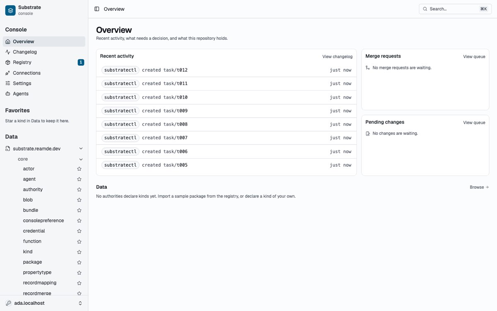
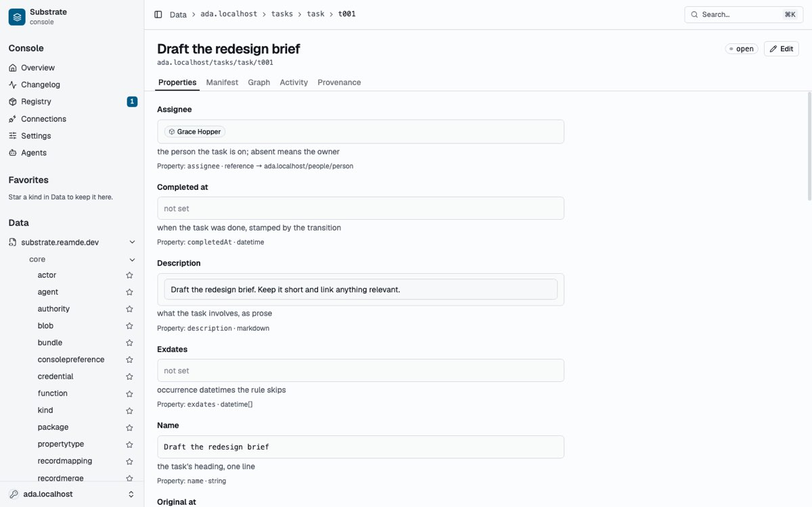

# First console review, 2026-09-24

A design review of the console as it stood on `main` at `970e7ae9`, before
the redesign. Every page was screenshotted against a dev repository
(`ada.localhost`) with the people and tasks samples imported and 23 records
seeded, the UI was inventoried file by file, and two directions were put into
one clickable [prototype](../prototype/console-prototype.html). This page is a
summary of that report; the redesign it led to is PR #648.

Its one-line verdict: the console works, but it does not look like it knows
who it is for.

## What the console is for

The review opened by stating the purpose the owner set, and every later
choice follows from it
([0130](../../decisions/0130-the-console-serves-four-things-and-its-navigation-follows-them.md)):
seeing, navigating and controlling four things.

- **Your data**: every collection and record, whether you made it, an agent
  made it for you, or a provider brought it in.
- **Your providers**: add one, sign in, pick what it brings in, see that it
  is working.
- **Your agents**: a chat app, agents on one side, their threads, and the
  conversation. A change an agent suggests shows up in the thread, not in a
  separate inbox.
- **Your tools**: the functions your agents use and the syncs providers run:
  what each can see and change, and when it last ran.

People will ask their agents to build apps on top of the substrate (a task
manager, a trip planner, a recipe book). What those apps store shows up in
the console as ordinary collections.

And two readers
([0131](../../decisions/0131-the-console-writes-for-two-readers-behind-one-switch.md)):
the console is written for everyday users, and developers get everything else
behind one switch, **Technical details**.

## What was wrong

1. **Navigation led with the system.** Data opened on
   `substrate.reamde.dev › core`, about twenty system kinds, before the
   repository's own. The Overview's Data card said no authority declared kinds
   while the repository held 23 records in 16 kinds. Six top-level places, and
   three of them (Registry, Connections, Settings) were the same job:
   connecting a provider. Breadcrumbs were blank on four areas, and one
   pointed at a route that did not exist.
2. **Tables showed everything and emphasised nothing.** Columns came out in
   alphabetical order, so Status and Due sat past the right edge while empty
   columns took their place. The title showed twice, both cut off. Headers
   were raw camelCase property names. Records were laid out five different
   ways across the app.
3. **Record pages were forms without the editing.** Each property took about
   130px (a bordered box, its description, a "Property: x · type" line), empty
   ones as much as filled ones, alphabetically. Editing opened a second page
   with a second layout, and the record's six tabs used the engine's words
   (Manifest, Graph, Provenance).
4. **Forms showed examples that looked like data, and ids instead of names.**
   Worked examples rendered nearly as dark as stored values; the reference
   picker showed a record id where the table showed the person's name; five
   different form treatments across the app.
5. **The copy was written for the engine.** "A source keeps its own record
   and points at this one through a mapping-owned slot; its properties reach
   here by projection." 134 native `title=` hovers against 9 real tooltips.
6. **Monospace everywhere, three sizes in one row.** The mono data style was
   applied 329 times, including on "just now" and "created"; a kind was
   rendered 13 different ways and a record reference about 11; a
   `--spacing: 0.235rem` override put every Tailwind step 6% off the standard
   scale; actors were raw ids, and the engine had two names.
7. **Connecting a service was spread over three pages.** Registry held
   install state and inputs, Connections held credentials and accounts,
   Settings held the same bundle's settings again. Connections' numbered steps
   were the part worth keeping.

## Bugs found along the way

Eight bugs that needed no redesign. All eight were fixed on the redesign
branch before the page work started.

| Where | What happened | Fixed by |
| --- | --- | --- |
| Overview, Data card | "No authorities declare kinds yet" with 16 kinds present | only core and published provider authorities count as machinery |
| Record, Provenance | reference values printed as `{ref}` | provenance renders a reference as the referent |
| Record editor | warned that `dueAt` was undeclared on a kind whose temporal trait binds it | core's fully qualified temporal trait binds its hot columns |
| App shell | no breadcrumb on four areas; one crumb pointed at a non-route | breadcrumbs cover connections, settings, agents and account |
| Tokens | "Revoke (signs out)" fired with no confirmation | revoking a token asks first and names what stops working |
| Record editor | worked examples read as stored values | a worked example reads as a placeholder |
| Reference picker | showed the record id instead of its title | a chosen reference reads by its record's title |
| Bundle settings | "Required" on every unset field before any input | a setting says it is required only once touched or saved |

## Six principles

1. **Your data first, the system when you ask for it.** The sidebar leads
   with your collections; the built-in kinds wait for Technical details.
2. **One element per idea.** A kind, a record, an actor, a state, a property
   and an id each get exactly one component, and nothing is drawn by hand.
3. **Friendly names for display, full references as identity.** Plural
   display names are UI labels only; wherever a kind is identified it is the
   full `authority/package/name`, in hover cards always and on screen with
   Technical details on. The API never sees a display name.
4. **Dense where you scan, open where you read.** Tables and property sheets
   get 30 to 38px rows; descriptions and prose get room.
5. **Monospace only for what you would copy.** Ids, references, YAML and
   URLs; never times, verbs or statuses.
6. **Everyday words, technical details on a switch.** "Works at",
   "Suggested", "Kept up to date by Google"; the switch adds references, ids,
   tiers and changelog numbers.

## The proposal

**Navigation.** From Overview, Changelog, Registry, Connections, Settings and
Agents over an authority tree, to: search and jump (⌘K); **Home**, **All
data**, **Agents**, **Tools**, **Providers** (Registry, Connections and
provider settings in one); **Your data** and one **From _Provider_** group
per provider; and at the foot **History** (was Changelog), **Settings** and
the **Technical details** switch.

**Shared components.** Each replaces a family of hand-drawn renderings:
`KindRef` (13 renderings), `RecordRef`, `ActorRef`, `StateBadge` with enum
values, `PropertySheet` (label left, value right, edit in place, empty
properties folded, a mark per row for where the value comes from) and
`PageHeader`. [The element catalogue](../elements.md) is what shipped.

**Copy, before and after.** "held by you · owner tier · Release" became
"Yours · You set this. Syncs keep their own version but never change yours. ·
Use Linear's · Stop overriding · follow Linear"; "Reference property:
assignee · 3 incoming" became "Tasks with this as their Assignee · 1 of 3
done"; "substratectl created task/t012" twelve times became "You via
substratectl created 12 tasks".

**Two proposals that needed the engine.**

- *Every kind says what it is for.* Of the 125 kinds the tree shipped, about
  31 are things you open, about 45 are details of those and about 49 are
  machinery. A kind-level key, `purpose: primary | supporting | internal`
  with absent meaning primary, lets the console list the first group only.
  This became [0106](../../decisions/0106-a-kind-declares-its-purpose.md).
- *Console settings live in the repository.* The console already kept its
  sidebar state on `substrate.reamde.dev/core/consolepreference`; add the
  layout settings (record width, table width, density, technical details,
  theme) to that kind, so every browser looks the same. The key-value
  `setting` records belong to bundles and are the wrong home. This became
  version 2 of the kind and
  [0132](../../decisions/0132-console-preferences-follow-the-person-and-a-window-fact-stays-in-the-browser.md).

## What the owner decided

- **Direction: Paper**, chosen on 25 September over the denser Workbench.
  Record, tool and provider pages start at the left edge at the width set in
  Settings; tables use the full window with a sticky header and first column,
  paged 50 rows at a time.
- **The `purpose` key** as proposed, with its three values.
- **The four earlier rulings of 2026-08-06**: actors get small marks (the
  no-avatar ruling reversed), history reads as sentences (reversed), data in
  monospace (reversed: mono only for what you copy), filters are full
  controls, never chips (kept).
- **Edit in place**, not on a separate page; YAML becomes the source view in
  technical mode.
- **One Providers page**, organised around each provider's setup steps;
  samples move to **Data › Add a collection**.
- **Technical details is per person**, stored on the console preference
  record so it follows the person.
- **System kinds** appear with Technical details on, in the sidebar's
  **Substrate** group and under Settings › Developer.

The plan shipped as proposed: foundations first (tokens, a type scale,
standard spacing, the identity components), then navigation, then the pages,
with a running copy pass. [The second review](2026-09-26-design-review.md)
measured the result.
