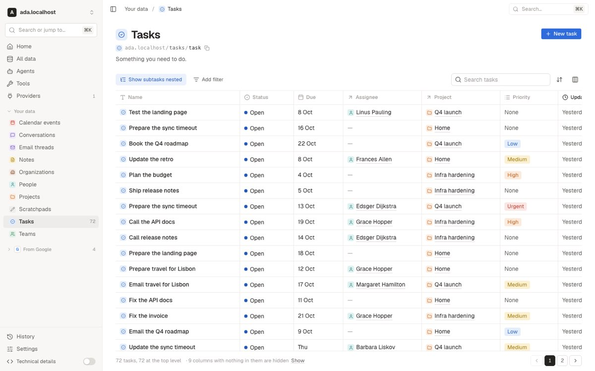
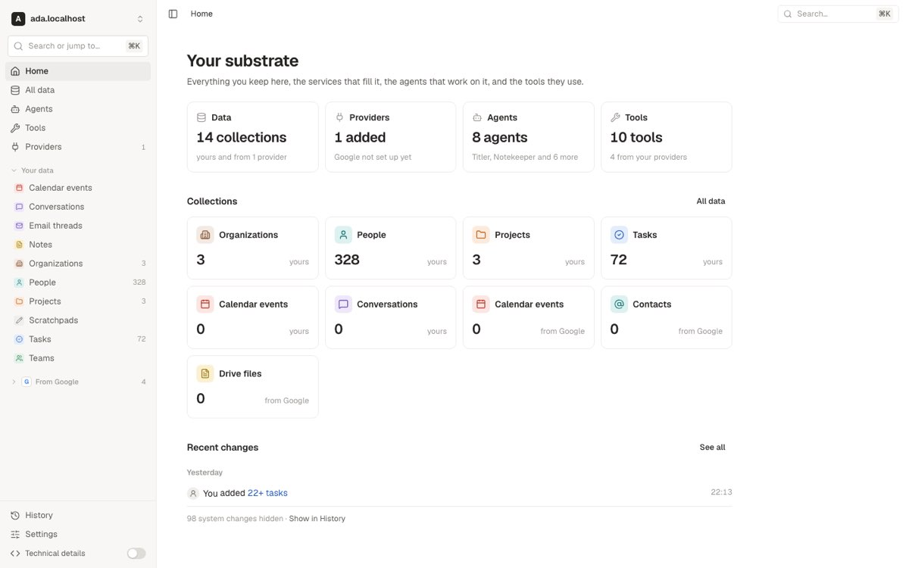
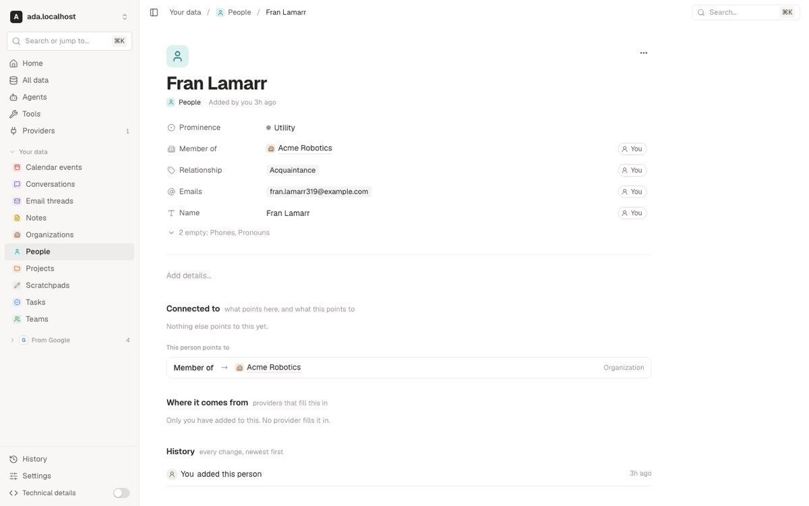
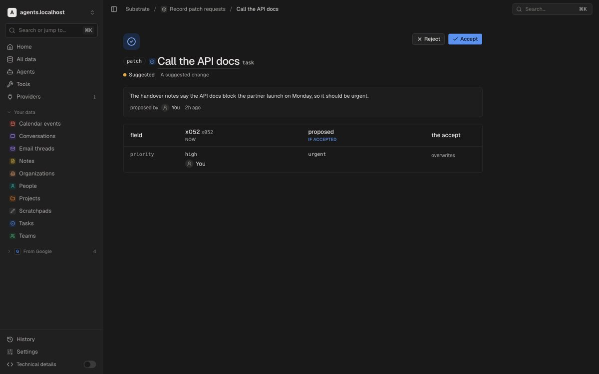
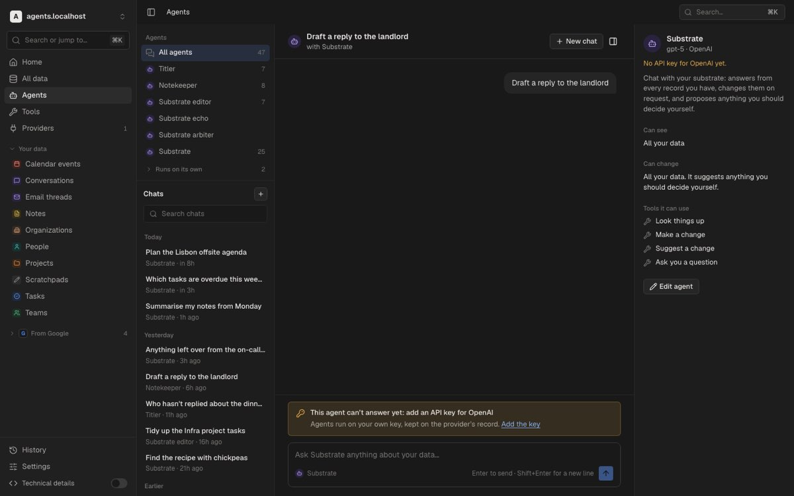
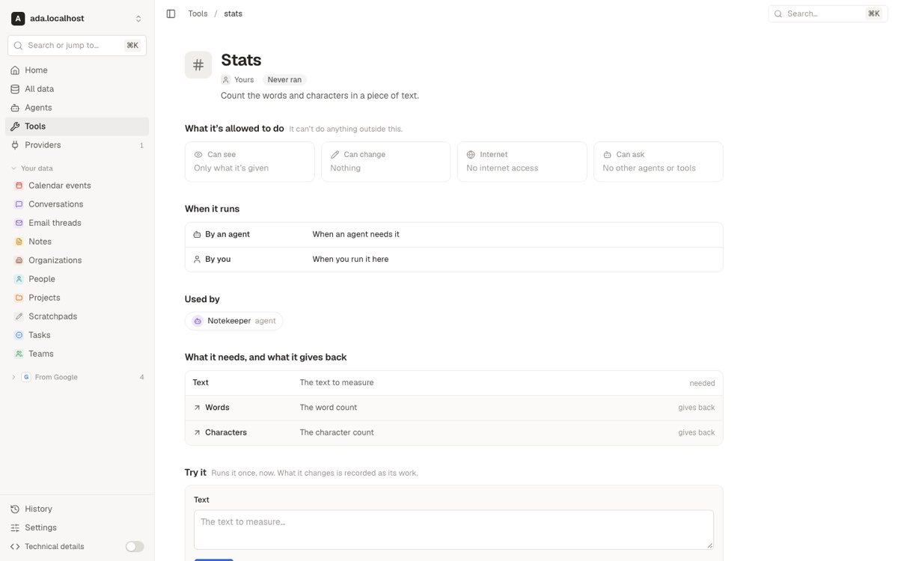

# Second design review, 2026-09-26

An independent review of the redesigned console on `console/redesign` at
`3a243d4c` (PR #648), measured against the approved
[prototype](../prototype/console-prototype.html), [the design
guide](../design-guide.md) as it was then, and the four purposes the owner
set: see, navigate and control your data, your providers, your agents and
your tools. Every page was looked at in light and dark, in everyday and
technical mode, at 1440, 1024 and 390px wide, against five dev repositories
(`ada`, `record`, `table`, `agents` and `providers`, all under `.localhost`).

This page summarizes the report and gives each finding its status now. The
screenshots are of the build as reviewed, before the fixes.

## Verdict

The redesign lands the Paper direction: the collection grid, the record page,
the tool page and the provider setup are calmer, denser and more legible than
the old console, the dark theme is thorough, and the identity components make
the whole thing read as one product. Where the build followed a prototype page
it was close to it. Where it had to invent (creating a record, reviewing a
suggested change, history sentences about system records, filtering by a
state) it fell back to the data model and the developer's vocabulary, and
those are the surfaces a person hits first when they try to *do* something.

Tally: 1 critical, 12 major, 30 minor, 14 polish.

### What to keep

The record page as a document; inline editing for enums, states, references
and lists; the tool page ("What it's allowed to do", "When it runs", "Used
by", Try it); provider setup as four numbered steps; the agent chat with tool
calls as one-line receipts and suggestion cards; the dark theme and the token
map; filters as full-size `property | value | ×` controls; the empty and
read-only states on collections; nested tasks; History's live tail and actor
views.

## Status

**Fixed** means fixed in PR #648, with the area it landed in. **Deferred**
names the GitHub issue that carries it. **Open question** is waiting on the
owner. **Not addressed** is still true of the code.

### Shell, sidebar and navigation

| Id | Severity | Finding | Status |
| --- | --- | --- | --- |
| S1 | major | Every collection page showed the kind reference in mono with a copy button in everyday mode; sidebar rows carried the raw reference as a browser tooltip | Fixed (collection head, sidebar): the reference line is technical-only and stays in the kind's hover card; a sidebar row tips its description |
| S2 | minor | Collapsing the sidebar was saved to the repository, so it collapsed on every device | Fixed (preferences): kept in this browser only, [0132](../../decisions/0132-console-preferences-follow-the-person-and-a-window-fact-stays-in-the-browser.md) |
| S3 | minor | A collapsed sidebar left nothing but the toggle | Fixed (shell): it peeks on hover at the page's side and from the toggle; the switch is in the account menu too |
| S4 | minor | The account menu signed out without asking; Settings asked; "Theme" beside "Appearance" | Fixed (dialogs): one `SignOutDialog`, one word, Appearance |
| S5 | polish | Crumbs and package pages fell back to raw names | Fixed (shell): display names outside technical mode |
| S6 | polish | The browser tab always said "Substrate Console" | Fixed (shell): a title per route and a polite live region announcing moves |

### ⌘K and Search

| Id | Severity | Finding | Status |
| --- | --- | --- | --- |
| K1 | major | ⌘K never showed a record, and matched collections by scattered letters | Fixed (command menu): the ranked read after 150ms, Records above Collections and Pages, word-prefix matching |
| K2 | minor | Search mixed machinery into everyday results and explained ranking in engine terms | Blurbs fixed (Search). Limiting everyday results to primary kinds was moved to later by the owner while the search API is reworked; no issue |

### Home and All data

| Id | Severity | Finding | Status |
| --- | --- | --- | --- |
| H1 | minor | Two "Calendar events" cards told apart by a faint caption | Fixed (Home): cards grouped as the sidebar groups them. "Made by an agent" deferred, #672 |
| H2 | minor | Home said "22+ tasks" where History said "60 tasks"; a system-changes line; no Recent chats | Fixed (Home): Recent chats above Recent changes, a run read until it closes or told without a count, the line dropped. Server-side run summaries deferred, #674 |
| A1 | major | "Add a collection › Start from a sample" listed things that are not collections | Fixed (All data, catalog): samples with at least one primary kind, read from the catalog closure's declared purposes; Tools and Agents offer the samples that bring them; updates on the package page |
| A2 | minor | "Ask an agent" handed the request to whichever agent was last used, and never sent it | Deferred, #680 |

### Collection tables

| Id | Severity | Finding | Status |
| --- | --- | --- | --- |
| T1 | major | Filters spoke in stored values, and an enum filter was a text box | Fixed (table): one `ChoiceList` in display words; the applied control reads "Status \| Open" |
| T2 | minor | "Name" twice in Sort and Columns; every empty property listed | Fixed (table): the title-backing property is the title column; empty columns under one disclosure |
| T3 | minor | The footer glued count, tree count and hidden-columns notice into one faint line | Fixed (table): the footer counts, the Columns button badges what is hidden. Saved views and Group by (from §20) deferred, #679 |
| T4 | minor | Provider collections showed the provider's bookkeeping (etag, cursors) as default columns | Not addressed |
| T5 | polish | A hover-only "Open" button; an unexplained "1/3" chip | Partly: the chip's title says "1 of 3 done"; the hover-only Open button is unchanged |
| T6 | polish | Paging by offset while the docs promised a cursor | Resolved in the docs: a page is an offset on the wire, and Next reads the page's own cursor |

### Record page and inline editing

| Id | Severity | Finding | Status |
| --- | --- | --- | --- |
| R1 | major | A "You" chip on every row when every value is yours | Fixed (record): the meta line says "Every value is yours" once and a chip marks only a departure; **Who holds each value** in the ⋯ menu shows them all |
| R2 | minor | The record hover card showed property keys and a raw referent id | Not addressed: the card's facts are still labelled by key |
| R3 | minor | The prose editor saved on blur and cancelled on Esc with no visible controls | Fixed (record): the list editor's footer and a saved note |
| R4 | minor | Dates edited in the browser's native control | Fixed (record): a Paper calendar popover, the native control kept on touch |
| R5 | polish | The ⋯ menu held one item | Fixed (record): Copy link, Duplicate, Who holds each value, Open in YAML (technical), Delete |
| R6 | polish | Enum colour differed between grid and sheet; two empty tokens; a wrapped empty line on a phone; "You set this" twice | Fixed (choice): one `EnumTag`, one `EmptyValue`, "N empty" alone on a phone, said once |

### Creating a record

| Id | Severity | Finding | Status |
| --- | --- | --- | --- |
| C1 | critical | The task create form crashed when "12 more" was opened | Fixed (create): the fold opens past an any-kind reference, with a test |
| C2 | major | The create form was a different product: native selects, stored values, an error before input | Fixed (create): a new record is the record page with an unsaved draft, required rows first, validation once a value moves |
| C3 | minor | Create-flow copy was the engine's | Fixed (create): "Ready to save", "Couldn't save: …", "Search people" |

### Merge and change requests

| Id | Severity | Finding | Status |
| --- | --- | --- | --- |
| M1 | major | The change request page was a developer view that everyday users were sent to | Fixed (agents): rebuilt from the chat card, Now beside If applied in the sheet's labels, ids and raw diff behind the switch |
| M2 | major | "Edit first" could not edit, and "Always allow this" could not take effect | Fixed in the console: "Review", and "Always allow this" removed. An allow that outranks a gate deferred, #671; adjusting a suggestion before applying it deferred, #673 |
| M3 | minor | The merge page spoke in keys and projection terms | Fixed (agents): labels, "Kept" and "Combined", "You can separate them again later" |
| M4 | minor | One click deleted from the chat card; the page asked first | Fixed (agents): Apply and Dismiss on both, a delete confirms in the one `ConfirmDialog` |

### Agents

| Id | Severity | Finding | Status |
| --- | --- | --- | --- |
| G1 | major | What an agent may see and change could be read but not changed; no agent page | Deferred, #678 |
| G2 | minor | "No API key yet" sent a person to a core record to paste a secret | Open question (a key dialog); carried in #678 |
| G3 | polish | Future relative times, stored words on cards, a folded "Runs on its own", no agent hover card | Fixed (agents): times clamp to "just now", display words, a captioned list, `AgentRef`'s hover card |

### Tools

| Id | Severity | Finding | Status |
| --- | --- | --- | --- |
| L1 | minor | Pausing a tool was immediate; pausing a provider asked | Fixed (dialogs): one `PauseDialog` for a tool, a provider and an account's sync |
| L2 | minor | "Never ran" on built-in tools that run inside every agent turn | Fixed (tools): an agent's tool is counted by its calls, and no run pill where nothing records runs |
| L3 | polish | Four renderings of "yours / from Google" | Fixed (heads): one `OriginMark` |

### Providers

| Id | Severity | Finding | Status |
| --- | --- | --- | --- |
| P1 | minor | A provider's page never showed what it did to your data | Fixed (providers): **Recent activity**, and each collection's last sync |
| P2 | minor | The sign-in details dialog explained its fields in developer notes | Fixed (providers): the console's own helper text; the declaration's in technical mode |
| P3 | polish | Technical mode printed whole declaration descriptions | Fixed (providers): two lines and "more" |

### History and actors

| Id | Severity | Finding | Status |
| --- | --- | --- | --- |
| Y1 | major | Sentences about system records read as nonsense ("You changed navigation"); a bare "+"; digests in everyday mode | Fixed (history): system records named by what they are, value moves spelled out, host-written properties left to technical mode |
| Y2 | minor | In technical mode the actor id sat inside the sentence | Fixed (history): after it, in the technical line, with a copy button |
| Y3 | polish | The table view: clock time only, truncated kind, a 12px expand chevron | Not addressed |

### Settings, sign-in and register

| Id | Severity | Finding | Status |
| --- | --- | --- | --- |
| E1 | minor | Account and session copy written for the operator | Fixed (auth, settings) |
| E2 | minor | "Repository" labels the sign-in field | Answered: the owner kept "Repository"; the helper text is friendlier |
| E3 | polish | Row height reached the grid and All data only | Fixed by naming it: the setting is **Table rows** |

### Technical mode

| Id | Severity | Finding | Status |
| --- | --- | --- | --- |
| X1 | minor | Gaps a developer hits in the first hour: copy buttons, a JSON view, run input and output, the request's policy and thread, thread cost, the mapping behind a synced value | Fixed across areas, except a copy button on the hover card's reference footer |
| X2 | minor | The technical sidebar drops display names entirely | Open question: raw names only, as built |

### Colour, type, responsiveness, accessibility, performance

| Id | Severity | Finding | Status |
| --- | --- | --- | --- |
| V1 | major | The faint text token failed contrast wherever it carried meaning; soft pill inks failed too | Fixed (tokens): `--faint-text` for text, `--faint` for decoration, darker pill inks; see [the guide](../design-guide.md#colour) |
| V2 | minor | Monospace where the guide says never | Fixed (copy): mono only for ids, references, YAML, URLs and code |
| V3 | polish | Type below the floor | Fixed (heads): an 11.5px floor, held by `lib/type-floor.test.ts`. The wordmark suggestion was not taken |
| W1 | minor | Page titles split mid-word on a phone | Fixed (heads): actions drop below the title under 560px |
| W2 | polish | Phone details | Follows R1 and R6 |
| B1 | major | Editing was mouse-first | Fixed (record): the title edits from the keyboard, cells announce label and value, focus returns, a 2px focus ring |
| B2 | minor | No `aria-sort`, small targets, no reduced motion, hand-copied segmented controls, a nested `main` | Fixed (dialogs) except `aria-sort`, deferred, #677 |
| Q1 | minor | Only the provider pages updated live | Fixed (table, record): the open collection and the record page follow the changes stream and mark what moved |
| Q2 | polish | Against a server without `count`, Home probes each collection | Not addressed: the server counts on request now ([0134](../../decisions/0134-the-records-list-counts-its-filtered-set-on-request.md)), so the probe runs only against an older one |

## Where the build left the prototype

The review listed each place the build departed from the prototype or the
guide, so the owner could say which were intended. The collection header's
reference line was reverted (S1), Home gained Recent chats (H2), the new
record became the record page (C2), the change request was rebuilt from the
card (M1), the ownership chip shows on departure only (R1), and mono leaks
were swept (V2). Saved views, Group by and the favorite star in the
collection's toolbar are later (#679). The priority cell stays a coloured tag
rather than the prototype's bar ladder, the same in grid and sheet (R6).

## Cross-cutting proposals

The report's §21 proposed system changes that resolve many findings at once.
All shipped in PR #648 except where noted; [the element
catalogue](../elements.md) describes each component as built.

- One `SectionHead`, replacing ten local copies.
- One pill family: `StateBadge` for states, one `Pill` for statuses, the
  shadcn `Badge` retired, the old identity shims deleted.
- One `EnumTag` and one `ChoiceList`.
- `PageHeader` with the glyph-above layout for records, merges, change
  requests and new records.
- Tokens: `--faint-text` beside `--faint`, darker pill inks, one empty mark.
  Row heights as tokens read by every list was not done: density is a table
  setting (E3).
- One `Segmented` control, and one `ConfirmDialog`.
- A word list for the copy pass, now in
  [the guide](../design-guide.md#words). The proposed linter rule (no
  `authority/package/name` rendered outside technical mode) was not built.
- Retire the create form's own controls, once the create page is the sheet.

## Open questions for the owner

1. The collection's reference line: reverted (S1).
2. Home's third section: Recent chats first, then Recent changes (H2).
3. The sign-in word: the owner kept "Repository" (E2).
4. Saved views and Group by: later, #679.
5. Apps built by agents: a package should record who declared it, #672.
6. "Always allow this": removed until the engine has an exception form,
   #671.
7. The technical sidebar: raw names only, as built (X2). Still open.
8. Sidebar state: per browser, answered by
   [0132](../../decisions/0132-console-preferences-follow-the-person-and-a-window-fact-stays-in-the-browser.md).
9. Model keys: whether a console dialog may write an OpenAI key. Still open,
   carried in #678.
10. Density: a table setting, named **Table rows** (E3).
