# Plan: apps, code first — one module behind the guest

Status: PROPOSAL B, 2026-09-12. The alternative to proposal A (views and apps
as declarative records, `docs/plans/apps.md` on its own branch). Both were
written from the same research, the same codebase maps and the same review;
where B departs from A it says so, and where B departs from the panel's
earlier code-first draft it says why. The one declaration it proposes is
[app.yaml](../../kinds/substrate.reamde.dev/core/app.yaml) on this branch, so
the page, the prototype and the seed share one spelling.

## The ask

Provide a JavaScript SDK for the records, let a person write HTML and React
inline in a manifest the way a function's Python sits inline in its record,
and let them build whatever they want; ship a few components for lists and
the like that they may use or ignore. Five apps must be easy: tasks (list,
add, mark done), a timeline over every temporal record, contacts over people,
projects with their tasks, and GitHub pull requests involving me and not done.
Mobile first, rendered in the console for now, quick to write by hand and by
an agent.

## B in one paragraph

An **app** is a record of one core kind, `substrate.reamde.dev/core/app`,
whose `source` holds one module: a TSX file that default-exports a React
component (`runtime: react`) or a whole HTML document (`runtime: html`). The
console mounts it behind the **guest**, the opaque-origin iframe at
`/app-frame.html` that proposal A landed, and speaks to it over the
**bridge**, the JSON-RPC-over-`MessagePort` channel A landed with it, whose
method names are MCP Apps'. Inside the guest the module imports
`substrate/app`, the SDK (records, hooks, functions, agents, the host chrome),
and optionally `substrate/ui`, the **kit** (a list, a row, a timeline, a
form, drawn in the console's own tokens). React, the SDK and the kit arrive
through an import map the guest shell writes, served from the console's own
assets; TSX becomes JavaScript inside the guest, with Sucrase, and nothing is
fetched from anywhere else because the guest's `connect-src` is `'none'`.
The host holds the token, checks every call against the app's declared
`permissions` by resolved kind identity, and honors the grant only when the
code and the grant were written at owner tier. There is exactly one format:
a list is a component the source imports, never a record the console
interprets. The five examples are 31 to 55 lines per document, code included.

## 1. The model: one kind

The declaration is
[app.yaml](../../kinds/substrate.reamde.dev/core/app.yaml); read it, it is
the contract. It mirrors
[function.yaml](../../kinds/substrate.reamde.dev/core/function.yaml): a
`runtime`, an inline `source`, one `permissions` object with the same grant
shape, and nothing the engine reads. Every key it uses is an admitted dialect
key (`writer`, `keyed`, `keyPattern`, `fields`, `default`, `min`), so
[decision 0020](../decisions/0020-dialect-keys-are-reserved-not-tolerated.md)
costs nothing; no reserved property name (`title`, `at`, `endsAt`, `dueAt`)
appears at any level; depth stays at three; `writer: owner` sits on the two
`text` properties, the branch that parses it. `go test ./kinds/...`,
`lint:yaml` and `fmt:yaml` pass on it as written.

**Why core and not a trait plus a sample.** The panel's draft put a marker
trait in core and the kind in a sample package so the owner could add
properties. Nobody reads those properties: the guest sees only what the
bridge hands it, and the bridge reads a fixed set. What the console needs is
one address, `substrate.reamde.dev/core/app`, that exists before any package
is imported and is spelled the same in every repository, and that is what a
core kind is. `writer: owner` on a core kind's property holds for the reason
A gave: the seed writes the declaration and never a row, and no shipped
closure may carry a `source` (a `kinds_test` refusing one lands with the
first console commit), so the one writer below owner tier a row could have is
refused before the question arises.

**Why one kind and no `view`.** In A the view is the atom because the
console renders it; addressing one alone is what makes it composable. In B
the console renders nothing of an app: the primitives are components, and
composing them is the source's job. A "view" that renders alone is an app
with one screen, which is what four of the five examples are. What the view
kind bought for placement, B keeps as two properties on the app: `attach`
(`launcher`, `home`, `record`, `browse`) and `via` (the reference property
that scopes the app on a record page). An app record therefore exists for
every screen a person wants, and the line budget below is what that costs.

**The properties, and the decision in each.**

- `name`, `description`, `icon`: the launcher row and the host's title bar.
- `runtime`: `react` or `html`, permanent once shipped, as every enum value
  in a live core kind is
  ([0066](../decisions/0066-a-backfill-and-an-enum-remap-are-ordinary-record-writes.md)
  cannot remap a value still admitted). `preact-htm` does not earn a place:
  it is a second syntax for a model to get wrong (`<${Row}>` and `<//>` are
  the error sites the earlier draft admitted), and the 35 kB it saves is paid
  once and cached.
- `source`: `text`, `fts: false`, `required`, `writer: owner`. Held by the
  host to 256 KiB, the cap `function.source` has; the server has no `max` in
  bytes for text and B makes no Go change to add one.
- `modules`: keyed `text`, `writer: owner`, imported as `#name`. Node's own
  convention for a package-internal import, chosen because a relative
  specifier cannot resolve from a `blob:`-backed module and a bare one can
  be mapped. The panel's `uses` (importing another app's source) is gone: a
  shared piece is a module, and cross-record imports wait until an app needs
  them.
- `permissions`: `reads.kinds`, `reads.traits`, `writes`, `call`, `agents`.
  `reads.traits` stays from the draft because the timeline is one of the
  five and listing eight implementors by hand is what a trait exists to
  avoid; the grant expands to implementors at mount and again when a
  `core/kind` row lands. `mutations` (merge, split) is dropped: both need the
  preview-bound confirmation of 0067 that the merge-request page owns.
- `inputs` and `bindings`: A's shape verbatim, so the two proposals share one
  resolver and one picker. `me` on the GitHub `user` mirror is the common one.
- `sdk`: the SDK major the source was written against, default 1. The host
  refuses a record newer than what it serves; a major grows additively; a
  break is the next major served beside it under a second import map.
- `requiresAtLeast`: [0070](../decisions/0070-a-copy-is-upgraded-through-its-origin-stamp-and-requires-pins-a-floor.md)'s
  floor keyed by package identity; a grant reference that resolves to no kind
  gates on presence (the launcher greys the row and names the package).
- `attach`, `via`, `home`: placement, from A, so the hybrid in section 7 is
  a merge and not a rewrite.

**The owner-provenance gate, widened.** Codex's blocker against A applies to
B verbatim: an agent allowed to write app records can rewrite `permissions`
(an object cannot carry `writer`) under an owner-written `source`. So the host
mounts an app only when `source`, `modules` and `permissions`, each that is
present, read back at `tier: owner` in the single-record read's
`propertyMeta`; below that there is no data, no RPC and no dry-run, the app
page shows the description, "needs the owner's review" and the source, and
the review screen offers "Take over", which rewrites the gated properties
under the owner's hand (a `null` patch, then the value, because echoing an
unchanged value is a no-op the engine skips). `inputs` and `bindings` are not
gated: they choose which record inside a granted kind, and the grant already
bounds what can be read.

**Words for [terms.md](../terms.md)**: **app** (a record of `core/app`: one
module the console mounts behind the guest), **guest** and **bridge** as A
defines them, **kit** (`substrate/ui`, the components served into the guest).
`module` stays dead for package and survives only as JavaScript's own word.

## 2. The SDK

### `substrate/app`

One specifier, importable from the source with no build step, resolved by the
guest shell's import map. Every records call is an RPC the host answers with
its own credential; the declarations and the resolved inputs arrive once, in
`hostContext`, and the hooks that read them make no call.

```ts
// records: every call an RPC; kind is a full reference
records.list(q: Query): Promise<Page>
records.get(kind, id): Promise<Record>
records.put(kind, {id?, properties, labels?}, {ifVersion?, idempotencyKey?}): Promise<Record>
records.patch(kind, id, {properties, labels?}, {ifVersion?}): Promise<Record>
records.delete(kind, id, {ifVersion?}): Promise<void>
records.transition(kind, id, property, to, {ifVersion?}): Promise<Record>
records.subscribe(q: Query, cb: (page: Page) => void): Unsubscribe

type Query = ({kind} | {kinds: string[]} | {implements: string}) &
  {filter?, orderBy?: string, first?: number, after?: string}
type Page = {records: Record[], cursor?: string, incomplete?: boolean, loading: boolean, error?: Error}

// hooks (runtime: react)
useRecords(q: Query): Page & {loadMore(): void}
useRecord(kind, id): {record?: Record, loading: boolean, error?: Error}
useKind(identity): Declaration | undefined   // properties, states, transitions, displayTemplate, enum labels, temporal point
useInput(name): {state: "bound"|"default"|"sole"|"none"|"ambiguous"|"missing"|"unknown-kind", record?: Record, status?: string}
useRoute(): {path: string, navigate(path: string): void}
useHost(): HostContext & {app: {id, name, record?: {kind, id}}}

// functions and agents
functions.call(ref, args, {idempotencyKey?}): Promise<{output, effects}>
agents.chat(ref, {thread?, message}, onEvent: (e: AgentEvent) => void): {stop(): void}

// the host chrome
host.title(text)                          host.navigate({path} | {record} | {app, path?})
host.back()                               host.openLink(url)      // http, https, mailto, tel; the host asks
host.primaryAction.set({label, enabled?} | null); host.primaryAction.onClick(cb)
host.back.onClick(cb)                     host.confirm({title, body?, destructive?}): Promise<boolean>
host.toast({title, description?, type?})  host.notifySizeChanged()   // honored in a card

// runtime: html, and anyone who wants the object instead of the hooks
createApp(): Promise<App>   // {hostContext, records, subscribe, functions, agents, host, route, kinds, inputs}
```

`useRecords` is `records.subscribe` under a hook: the host answers the first
page and keeps the subscription, re-running it and pushing the new page when
the live tail invalidates one of its kinds. `useKind` reads the `KindInfo`
rows the host handed over at mount for every kind the grant covers, so a
transition or a form can check the machine and label an enum without a call.
`useInput` is the bundle's rule, resolved by the host: bound, then the id
`default`, then the sole record, else nothing, with a dangling binding
reported as `missing` and never silently replaced.

An `implements` query is the timeline's: the host expands the trait to its
implementors, intersects them with the grant, runs one list per implementor
with `at` in `filter` and `orderBy` rewritten to that kind's bound point
(`dueAt` for a task, `at` for an event), merges by the point and delivers one
page. A kind whose page still had a cursor sets `incomplete`, and the kit's
`Timeline` says so at its foot rather than hiding the day. This is A's v0 fan
out done by the host; when the trait records route takes `from`, `to` and
`first`, the host collapses it to one request and no app changes.

Absent, not refused: GraphQL documents, `fetch`, the token, the vocabulary,
the catalog, OAuth, blobs, the actor header.

### React in the guest

The guest shell writes one import map before any module loads:

| specifier | build | dev |
|---|---|---|
| `react`, `react/jsx-runtime`, `react-dom/client` | `/assets/app-react.js` and two siblings, entries that re-export the console's own React | `/src/apps-sdk/react.ts` and siblings, transformed on request |
| `substrate/app` | `/assets/app-sdk.js` | `/src/apps-sdk/index.ts` |
| `substrate/ui` | `/assets/app-ui.js` | `/src/apps-sdk/ui/index.ts` |
| `#<name>` | a `blob:` URL per entry of `modules`, minted at mount | the same |

The three React entries, the SDK and the kit are entries of the console's own
Vite build (`preserveEntrySignatures: "exports-only"`, fixed file names, the
pattern A's `app-sdk` already uses), so rolldown puts React in one shared
chunk they all import and the app, the SDK and the kit see one React instance;
two copies would break hooks, and this is the one build fact the design
depends on. Nothing is fetched from the internet: `connect-src 'none'` and
`script-src 'self'` see to it, and a source that imports anything outside the
map fails to resolve before it runs. Sizes, gzipped, immutable under
`/assets/` and so paid once per binary: React with `react-dom/client` about
45 kB, the SDK under 8 kB, the kit budgeted at 15 kB, Sucrase about 75 kB
loaded lazily and only for `runtime: react`. The first app on a phone costs
about 140 kB once; the second costs its own source.

### TSX with no build step

Inline JSX and TypeScript become JavaScript inside the guest, with
[Sucrase](https://github.com/alangpierce/sucrase): transforms `typescript`
and `jsx` with the automatic runtime, `production: true`, ES modules kept as
written. Sucrase is chosen for two facts. It is line-preserving, so a runtime
error's line is the author's line with no source map; and it is a parser and
printer with no evaluator, small enough to lazy-load. What it is not is a
checker: a type error is not reported, and the SDK's `.d.ts` exists for the
editor and the model, not for the guest. The alternatives, each rejected:
esbuild-wasm (a 10 MB binary), Babel standalone (3 MB), htm (a second
syntax), and esbuild in the Go server on apply. The last is the one that
would keep this design intact if the browser transform ever proves too slow:
the host would send JavaScript instead of TSX and the guest would skip a
step; it is a later option, not v1, because it adds a Go dependency, a second
stored artifact and a server that reads app code.

The transform runs per mount, in the guest, on the source and every module:
about five milliseconds for a 60-line app, so nothing is cached beyond the
browser's cache of the Sucrase chunk. A `SyntaxError` carries `line` and
`column`; the shell reports it to the host as `substrate/notifications/error`
with `phase: "transform"` and the host draws it above the frame with the
offending source line. `runtime: html` skips the transform entirely: the
document is written into the shell as A's custom layout is, with the same
import map prepended.

### The kit, `substrate/ui`

Seventeen components, all optional, all drawn in the console's tokens so an
app using them looks native, all sized for touch (48 px rows, 44 px controls,
16 px base). Raw HTML and CSS are allowed beside or instead of them: the
frame takes what it is given, and the raw example proves it.

| component | contract |
|---|---|
| `Screen` | `title`, `back`, `primary {label, onPress}`, `loading`; wires the host chrome through `host.title`, `host.primaryAction` and `host.back` |
| `List` | rows from a `page` or `records`; `groupBy` a property name (`dueAt` sections Overdue to Undated; a state or enum sections by value) or a function; `index` for an A–Z rail; `empty`; loads more when the page has a cursor |
| `Row` | `title`, `subtitle`, `meta`, `when` (relative time), `leading`, `trailing`, `chevron`, `record` (tap opens the console's record page), `onTap`, `actions[{icon, href \| onPress}]` as trailing 44 px buttons; a hold opens the rest |
| `Group` | a titled section with an optional trailing button |
| `QuickAdd` | one input that puts a record of `kind` with `property` set and `defaults` merged, minting an `Idempotency-Key` once per pending submit |
| `Check` | a 44 px toggle for a transition; `disabled`, `pending` |
| `Badge`, `StateBadge` | text, and a state drawn as the console draws it |
| `Button` | the console's button, four sizes |
| `Sheet` | an in-frame bottom sheet with a scrollable body and a footer |
| `Form` | the declaration's own controls for a kind and a `prompt` list, the required properties always asked; submits a put or a patch; renders `problemDetails` on the fields |
| `RecordField` | one property rendered by datatype: state, enum label, reference title, datetime, url, markdown |
| `Timeline` | records grouped by local day from each record's bound point, today marked, a kind badge per row, an incomplete note when a cursor remained |
| `Board` | columns from a state property's declared states (or the filter's `in`), a drag along a declared arm only, a segmented control over one column under 768 px |
| `Avatar` | initials from a name |
| `Empty`, `Spinner` | the two states every list has |

The kit is additive only: a prop never changes meaning and a component is
never removed within an SDK major. `Form` and `Board` read the declaration
the host handed over, which is how a kit component knows a machine's arms
without a call.

## 3. The five examples, and one without the kit

Exactly as applied on the dev repository (`.dev/seed/apps.yaml`), against the
rehomed references of `ada.example.com`. One `substratectl apply -f` each.
Line counts are the whole document as printed, comments excluded.

**Tasks: list open, add one, mark done. 39 lines, 25 of them code.**

```yaml
kind: substrate.reamde.dev/core/app
metadata:
  id: tasks
data:
  properties:
    name: Tasks
    icon: check-square
    runtime: react
    attach: [launcher, browse]
    permissions:
      reads:
        kinds: [ada.example.com/tasks/task]
      writes: [ada.example.com/tasks/task]
    source: |
      import { useRecords, records } from "substrate/app"
      import { Screen, QuickAdd, List, Row, Check } from "substrate/ui"

      const TASK = "ada.example.com/tasks/task"

      export default function Tasks() {
        const open = useRecords({
          kind: TASK,
          filter: { properties: { status: { in: ["open", "proposed"] } } },
          orderBy: "dueAt:asc",
        })
        const done = (t) =>
          records.transition(TASK, t.id, "status", "done", { ifVersion: t.version })
        return (
          <Screen title="Tasks">
            <QuickAdd kind={TASK} property="name" placeholder="Add a task" />
            <List page={open} groupBy="dueAt" empty="Nothing open">
              {(t) => (
                <Row key={t.id} title={t.properties.name} when={t.properties.dueAt} record={t}
                  leading={<Check disabled={t.properties.status !== "open"} onChange={() => done(t)} />} />
              )}
            </List>
          </Screen>
        )
      }
```

`in: [open, proposed]` because the grammar has no `ne`. `transition` is a
`PATCH {"properties":{"status":"done"}}` with the row's version as the
precondition, checked against the declared machine by the host first, which
is why the check is disabled on a `proposed` row: its machine has no arm to
`done`. The row leaves the list when the tail pushes the next page, within a
beat. `attach: browse` puts the app on the task kind's page as a tab.

**Timeline of every temporal record. 31 lines, 18 of them code.**

```yaml
kind: substrate.reamde.dev/core/app
metadata:
  id: timeline
data:
  properties:
    name: Timeline
    icon: calendar-days
    runtime: react
    attach: [launcher, home]
    permissions:
      reads:
        traits: [substrate.reamde.dev/core/temporal]
    source: |
      import { useRecords, host } from "substrate/app"
      import { Screen, Timeline } from "substrate/ui"

      const day = (n) => new Date(Date.now() + n * 864e5).toISOString()

      export default function Agenda() {
        const page = useRecords({
          implements: "substrate.reamde.dev/core/temporal",
          filter: { properties: { at: { gte: day(-7), lt: day(30) } } },
          orderBy: "at:asc",
          first: 300,
        })
        return (
          <Screen title="Timeline">
            <Timeline page={page} onTap={(r) => host.navigate({ record: r })} />
          </Screen>
        )
      }
```

The grant is a trait; the host reads its implementors through
`GET …/core/trait/{id}/implementors`, runs one windowed list per implementor
on that kind's own point, and `at` in the query means "the bound point"
because the GraphQL `Temporal.at` is null for a renamed point
([traits.md](../traits.md)) and nothing here rides the preview surface
([0053](../decisions/0053-rest-is-supported-all-of-graphql-is-preview.md)).
On the dev repository that is tasks, task logs, calendar events and
transcripts, interleaved under one day header each.

**Contacts over people. 43 lines, 29 of them code.**

```yaml
kind: substrate.reamde.dev/core/app
metadata:
  id: contacts
data:
  properties:
    name: Contacts
    icon: contact
    runtime: react
    attach: [launcher, browse]
    permissions:
      reads:
        kinds: [ada.example.com/people/person]
      writes: [ada.example.com/people/person]
    source: |
      import { useRecords } from "substrate/app"
      import { Screen, QuickAdd, List, Row, Avatar } from "substrate/ui"

      const PERSON = "ada.example.com/people/person"
      const nameOf = (p) => p.properties.displayName ?? p.properties.name ?? "?"

      export default function Contacts() {
        const known = useRecords({
          kind: PERSON,
          filter: { properties: { prominence: { eq: "known" } } },
          orderBy: "title:asc",
          first: 500,
        })
        return (
          <Screen title="Contacts">
            <QuickAdd kind={PERSON} property="name" defaults={{ prominence: "known" }} placeholder="New person" />
            <List page={known} groupBy={(p) => nameOf(p)[0].toUpperCase()} index>
              {(p) => (
                <Row key={p.id} title={nameOf(p)} subtitle={p.properties.emails?.[0]} record={p}
                  leading={<Avatar name={nameOf(p)} />}
                  actions={[
                    p.properties.emails?.[0] && { icon: "mail", href: `mailto:${p.properties.emails[0]}` },
                    p.properties.phones?.[0] && { icon: "phone", href: `tel:${p.properties.phones[0]}` },
                  ]} />
              )}
            </List>
          </Screen>
        )
      }
```

`orderBy: title` is the record column, and a person's title is
`{displayName|name}`, so the rail sorts by what it shows. A person is born
`utility`, so the quick-add seeds `prominence: known` (a create may name a
state directly) or the new row would never appear in its own list. An
`actions[].href` goes through `ui/open-link`, the one way a `mailto:` or
`tel:` leaves the frame, and the host asks first.

**Projects with their tasks: list to detail inside the app. 55 lines, 42 of them code.**

```yaml
kind: substrate.reamde.dev/core/app
metadata:
  id: projects
data:
  properties:
    name: Projects
    icon: folder-kanban
    runtime: react
    permissions:
      reads:
        kinds: [ada.example.com/tasks/project, ada.example.com/tasks/task]
      writes: [ada.example.com/tasks/task]
    source: |
      import { useRecords, useRecord, useRoute, records } from "substrate/app"
      import { Screen, QuickAdd, List, Row, Check, StateBadge } from "substrate/ui"

      const PROJECT = "ada.example.com/tasks/project"
      const TASK = "ada.example.com/tasks/task"

      function Projects() {
        const { navigate } = useRoute()
        const page = useRecords({ kind: PROJECT, orderBy: "name:asc",
          filter: { properties: { status: { in: ["active", "onhold"] } } } })
        return (
          <Screen title="Projects">
            <List page={page}>
              {(p) => <Row key={p.id} title={p.properties.name} chevron onTap={() => navigate(`/${p.id}`)}
                trailing={<StateBadge value={p.properties.status} />} />}
            </List>
          </Screen>
        )
      }

      function Project({ id }) {
        const { record: project } = useRecord(PROJECT, id)
        const ref = `${PROJECT}/${id}`
        const tasks = useRecords({ kind: TASK, orderBy: "dueAt:asc",
          filter: { properties: { project: { eq: ref }, status: { eq: "open" } } } })
        const done = (t) => records.transition(TASK, t.id, "status", "done", { ifVersion: t.version })
        return (
          <Screen title={project?.properties.name ?? "…"} back>
            <QuickAdd kind={TASK} property="name" defaults={{ project: ref }} placeholder="Add a task" />
            <List page={tasks} empty="No open tasks">
              {(t) => <Row key={t.id} title={t.properties.name} when={t.properties.dueAt} record={t}
                leading={<Check onChange={() => done(t)} />} />}
            </List>
          </Screen>
        )
      }

      export default function App() {
        const { path } = useRoute()
        const id = path.slice(1)
        return id ? <Project id={id} /> : <Projects />
      }
```

The in-app route is the URL's own splat, `/apps/projects/website`, so a
reload lands on the project and the OS back gesture returns to the list: the
host owns history and `navigate` pushes it. `Screen back` is the host's back
button. The same source with `attach: [record]` and `via: project` would
mount the task list as a card on every project's record page, with the
record handed in through `useHost().app.record`.

**GitHub pull requests involving me, not done. 43 lines, 25 of them code.**

```yaml
kind: substrate.reamde.dev/core/app
metadata:
  id: pulls
data:
  properties:
    name: Pull requests
    icon: git-pull-request
    runtime: react
    inputs:
      me:
        kind: providers.substrate.reamde.dev/github/user
        description: the GitHub profile whose pull requests these are
    permissions:
      reads:
        kinds:
          - providers.substrate.reamde.dev/github/pullrequest
          - providers.substrate.reamde.dev/github/user
    source: |
      import { useRecords, useInput, host } from "substrate/app"
      import { Screen, Group, List, Row, Badge, Empty } from "substrate/ui"

      const PR = "providers.substrate.reamde.dev/github/pullrequest"

      export default function Pulls() {
        const me = useInput("me")
        const page = useRecords({ kind: PR, orderBy: "updatedAt:desc", first: 200,
          filter: { properties: { state: { in: ["open", "draft"] } } } })
        if (!me.record) return <Empty title="Connect GitHub" description={me.status} />
        const login = me.record.properties.login
        const mine = page.records.filter((r) => r.properties.authorLogin === login)
        const theirs = page.records.filter((r) => r.properties.authorLogin !== login)
        const row = (r) => (
          <Row key={r.id} title={r.properties.title} meta={`#${r.properties.number} · ${r.properties.authorLogin}`}
            trailing={<Badge>{r.properties.state}</Badge>}
            onTap={() => host.openLink(r.properties.htmlURL)} />
        )
        return (
          <Screen title="Pull requests" loading={page.loading}>
            <Group title="Mine"><List records={mine} empty="Nothing open">{row}</List></Group>
            <Group title="Waiting on me"><List records={theirs} empty="Nothing waiting">{row}</List></Group>
          </Screen>
        )
      }
```

The mirror is already involvement-scoped (the sync's search is
`involves:<login>` plus `review-requested:`), so "involving me" is the
collection and "not done" is the state. `me` is the GitHub `user` mirror,
resolved by the bundle's rule; with one connected account it is the sole
record and nobody is asked, with two the app's settings sheet writes
`bindings.me`. Before the provider is installed the two `reads.kinds`
references resolve to nothing and the launcher greys the row with "needs
providers.substrate.reamde.dev/github". `updatedAt` on this kind shadows the
row's own column and orders by sync time; provider version 11's `activityAt`
is the fix and a one-word change here, and the SDK's runtime check names the
shadow as a warning until then. A PR's `title` is the built-in column the
sync writes, since the kind declares none, and it reads back inside
`properties` like every column does.

**The same tasks app with no kit and no React. 46 lines, 33 of them code.**

```yaml
kind: substrate.reamde.dev/core/app
metadata:
  id: tasks-raw
data:
  properties:
    name: Tasks (raw)
    icon: code
    runtime: html
    permissions:
      reads:
        kinds: [ada.example.com/tasks/task]
      writes: [ada.example.com/tasks/task]
    source: |
      <!doctype html>
      <meta charset="utf-8">
      <style>
        body { margin: 0; font: 16px var(--font-sans, system-ui); background: var(--background); color: var(--foreground) }
        form { display: flex; gap: 8px; padding: 12px }
        input { flex: 1; min-height: 44px; padding: 0 12px; font: inherit; color: inherit; background: none;
          border: 1px solid var(--border); border-radius: var(--radius) }
        button { min-width: 44px; min-height: 44px; font: inherit; border-radius: var(--radius) }
        li { display: flex; align-items: center; gap: 12px; min-height: 48px; padding: 0 12px; border-top: 1px solid var(--border) }
      </style>
      <form><input name="name" placeholder="Add a task" autocomplete="off"><button>Add</button></form>
      <ul id="list" style="list-style: none; margin: 0; padding: 0"></ul>
      <script type="module">
        import { createApp } from "substrate/app"
        const TASK = "ada.example.com/tasks/task"
        const app = await createApp()
        const list = document.getElementById("list")
        app.subscribe({ kind: TASK, orderBy: "dueAt:asc", filter: { properties: { status: { eq: "open" } } } },
          ({ records }) => list.replaceChildren(...records.map((t) => {
            const li = document.createElement("li")
            const done = Object.assign(document.createElement("button"), { textContent: "✓", title: "Done" })
            done.onclick = () => app.records.transition(TASK, t.id, "status", "done", { ifVersion: t.version })
            li.append(done, Object.assign(document.createElement("span"), { textContent: t.properties.name ?? t.id }))
            return li
          })))
        document.forms[0].onsubmit = async (e) => {
          e.preventDefault()
          const name = e.target.name.value.trim()
          if (!name) return
          e.target.reset()
          await app.records.put(TASK, { properties: { name } })
        }
      </script>
```

Thirty-three lines of raw code against twenty-five with the kit, and the
difference is all styling and DOM bookkeeping: the SDK surface is the same
object. The console's tokens (`--background`, `--border`, `--radius`,
`--font-sans`) are on the guest's `:root` before the document's own styles
apply, so even this one is drawn in the console's palette and flips with its
theme.

| app | document | code |
|---|---:|---:|
| tasks | 39 | 25 |
| timeline | 31 | 18 |
| contacts | 43 | 29 |
| projects | 55 | 42 |
| pulls | 43 | 25 |
| tasks-raw | 46 | 33 |

Against A: A's tasks view is 24 lines and its projects trio 64 across three
documents. B's tasks is 39 and projects 55 in one. B is longer where A's
renderer already knows the answer and shorter where A needs a second
document; and B's fifty-five lines carry a list-to-detail navigation A
expresses through `opens`, `related` and `via` across three records.

## 4. Runtime

### The guest

`<iframe sandbox="allow-scripts" referrerpolicy="no-referrer" src="/app-frame.html">`,
navigated from code so the `ready` listener is armed before the shell can
announce itself; the one `"*"` post the boundary allows carries the mount and
the port, made once per navigation the host itself made, and every later
message is on the port. The shell is A's `frame/main.ts` with a second arm.
For `runtime: html` it does what A does: `document.open()`, the import map,
the viewport meta, the document, `close()`, and the port survives in the
module's own variable because `open()` erases listeners and not code. For
`runtime: react` it loads Sucrase, transforms `source` and every entry of
`modules`, mints a `blob:` URL per module, writes the import map with the
`#name` entries added, `import()`s the entry, and renders its default export
into `#root` under an error boundary; a module that exports `mount(root)`
instead is called with the element. Both arms report `ui/initialize` with the
SDK, and the host draws the description and an "open source" link over a
frame that has not spoken within five seconds.

The guest's policy is A's, as A landed it in the meta tag and as v1 sends it
from the Go route, with one token added:

```
default-src 'none'; script-src 'self' 'unsafe-inline' blob:; style-src 'unsafe-inline';
img-src data: blob:; font-src 'self'; connect-src 'none'; worker-src 'none';
frame-src 'none'; form-action 'none'; base-uri 'none'
```

`blob:` in `script-src` is what lets a transformed module be imported as a
module rather than inlined as text. It widens nothing: a `blob:` URL can be
minted only by the guest's own script, which already runs under
`'unsafe-inline'`, and the one thing a `blob:` script could do that an inline
one cannot, spawn a worker, is closed by `worker-src 'none'`. Everything else
A established stands: `connect-src 'none'` closes fetch, XHR, WebSocket and
beacons; `img-src` without a host closes the image beacon; the origin is
opaque so `localStorage` throws; `/api` answers no CORS, and its absence is
the wall.

### The bridge

JSON-RPC 2.0 over the port, A's `protocol.ts` and `host.ts` extended. Method
names are MCP Apps' wherever that protocol has the word; the `substrate/*`
family is what the console's chrome and data layer need and a foreign host
ignores.

| direction | method | carries |
|---|---|---|
| guest → host | `ui/initialize` | answered with `hostContext` (theme, `displayMode`, `containerDimensions`, `safeAreaInsets`, locale, time zone, `styles.variables`, `styles.fontFaces`) plus `app {id, name, route, record?, inputs}` and `kinds` (the `KindInfo` rows the grant covers, implementors expanded) |
| guest → host | `ui/notifications/initialized` | the guest is drawing |
| host → guest | `ui/notifications/host-context-changed` | theme, size, insets, display mode |
| guest → host | `tools/call` | `substrate.records.list \| get \| put \| patch \| delete \| transition`, `substrate.functions.call`, `substrate.agents.chat`; each checked against the grant |
| guest → host | `substrate/records/subscribe`, `substrate/records/unsubscribe` | a query; answered with the first page and a subscription id |
| host → guest | `substrate/notifications/records` | `{subscription, page}` on every change the tail invalidates |
| host → guest | `substrate/notifications/agent-event` | `{stream, event}`, the six ndjson event kinds |
| guest → host | `ui/open-link` | `http`, `https`, `mailto`, `tel`; the host asks the person |
| guest → host | `substrate/navigate` | `{path}` (in-app, the splat), `{record}` (the console's record page), `{app, path?}` |
| host → guest | `substrate/notifications/route-changed` | `{path}` |
| guest → host | `substrate/title`, `substrate/primary-action`, `substrate/toast` | the chrome |
| guest → host | `substrate/confirm` | `{title, body?, destructive?}`, answered with the person's choice |
| host → guest | `substrate/notifications/primary-action`, `substrate/notifications/back` | taps on the host's buttons |
| guest → host | `substrate/notifications/error` | `{phase: transform \| runtime \| grant, message, line?, column?, module?}` |
| guest → host | `ui/notifications/size-changed` | honored in a card, capped at 60 vh |
| host → guest | `ui/resource-teardown`, `ping` | before unmount; every 5 s, three misses tear the frame down |

**Permissions are checked per call, by resolved identity.** The kind the
guest names is looked up in the registry and the grant is asked about what
was found, so a spelling that is not a kind is refused as unknown rather than
matched as a string (A's `checkAccess`, unchanged). Reads are held to
`reads.kinds` plus the implementors of `reads.traits`; writes to `writes`;
`transition` needs both arms; `functions.call` to `call`; `agents.chat` to
`agents`. A function whose `confirmation` is `always` or whose `effect` is
`external` or `irreversible` is confirmed by the host, never by the document
that asked. A subscription is checked when it opens and again on every push,
against the grant as it stands, so an app saved with a narrower grant loses
the data it no longer covers on the next beat. Below owner provenance (section
1) the host answers no read, no write and no subscription, whatever the row
says; the frame is not mounted at all.

### Live data

One `watchChanges` tail per tab, ref-counted over the union of every mounted
caller's kinds, is A's `hooks/use-live-records.ts`, and B reuses it with
`core/app` in its always-on set instead of `core/view`. Per row the tail
invalidates the `["records", …]` and `["record", …]` keys for every kind in
`affected`
([0061](../decisions/0061-a-change-event-names-the-affected-records-and-clients-fetch-them.md)),
and each open subscription is a TanStack query observer the host created, so
an invalidation re-runs it and the new page is pushed. Console and apps share
one cache: a task list open in the console and the tasks app open in another
tab are one query. Subscribe, then refetch: every time the stream reports
`live` the watched kinds are invalidated once, so a write between the first
page and the stream opening is not lost, which was Codex's finding against
the thirty-second `staleTime`.

### Writes

`put` with no id carries an `Idempotency-Key` the SDK mints once per pending
call and reuses on retry; `patch`, `delete` and `transition` carry
`ifVersion`; `transition` reads the row, checks the machine, and patches under
the version it read. `409 conflict` is surfaced as an error the kit's `Check`
shows and never retried by the SDK. There is no optimistic layer in the SDK:
the app holds the page and can rewrite it in three lines, and the pushed page
confirms or corrects it within a beat. Every write carries
`X-Substrate-Actor: console` and no label: the changelog carries attribution,
and an `app:` actor waits on
[0025](../decisions/0025-an-actor-carries-the-full-authority.md)'s reopen
clause.

### Host chrome, routes, attach points, the launcher

Routes `/apps`, `/apps/$id` and `/apps/$id/$`, the splat being the app's own
path, all with `staticData: {chrome: "app"}` so `AppShell` drops its sidebar
and header under 768 px, exactly as A's routes do. The chrome is A's
`AppChrome`: a header with back and title, the one primary button pinned
above the safe area and hidden while an input has focus, `html.touch` on the
root for 16 px and 44 px targets. The app drives it through the SDK:
`host.title`, `host.primaryAction`, and `Screen back` maps to the host's back
button, which is `history.back()` while the splat is non-empty and `/apps`
when it is. An overflow menu holds Settings (the inputs picker, writing
`bindings`), Open record (the app's own record page, where the YAML editor
is) and Reload. Full-page the frame owns its scroll; insets travel in
`hostContext` because `env()` is zero inside an iframe; the guest's viewport
meta carries `interactive-widget=resizes-content` so the keyboard resizes
rather than covers.

`attach` decides placement: `launcher` (the default) lists the app at
`/apps` and in the phone's bottom bar; `home` mounts it as a card on the
overview in inline mode; `record` mounts it as a card on the record pages of
the kind `via` points at (or of every kind in `reads.kinds` when `via` is
absent), handing the record in through `hostContext.app.record`; `browse`
adds a tab to the kind's page. The launcher is A's, reading one collection
instead of two, greying an entry whose grant names a kind the registry lacks
and naming the package.

**Hot reload.** The app collection is in the tail's always-on set; saving the
record through `apply`, the editor or an accepted proposal invalidates the app
query, the host hashes `source` and `modules`, and a changed digest remounts
the guest with the route preserved. `apply` is the dev loop.

## 5. Authoring

**A person** writes the YAML above and runs `substratectl apply -f`, or
edits it in the record editor, where every declared key completes and lints
and the source is a literal block. In v0 the TSX inside the block has no
highlighting; v1 adds a lazy CodeMirror TSX mode over that one property, and
a draft mode on the app page runs the unsaved source in the guest beside the
editor, which the sandbox is what makes safe.

**Errors reach the host, with lines.** A transform error carries the
author's line and column; a runtime error's line is the author's because the
transform is line-preserving, and the kit's own frames are elided from the
stack; a grant refusal names the call and the kind
(`permissions.writes: add ada.example.com/tasks/task`); a filter or
transition that names a property the declaration lacks is a warning naming
the kind, checked by the SDK against the declaration it holds. All four are
`{path, message}` in the shape the API's `problemDetails` takes, drawn by the
host in a strip above the frame and listed on the app's record page, so the
person and the agent read one format.

**An agent** is handed `lib/apps/prompt.ts`'s text, assembled from the live
registry so every kind reference is the repository's rehomed spelling: the
SDK's `.d.ts` (generated from the SDK source at build, under two thousand
tokens), the kit's catalog (name, props, the one-line contract from the table
above), the resolved declarations of the kinds the app will touch, the tasks,
projects and pulls examples verbatim, and a checklist in Farcaster's
register: default-export a component; import only `react`, `substrate/app`,
`substrate/ui` and your own `#modules`; no `fetch`, no `window.open`, no
`localStorage`; every kind touched appears in `permissions`; a state moves by
`transition`; a filter is the JSON grammar and `contains` is membership, not
substring; `orderBy` is camelCase; `source` is written by `propose`, never
`mutate`.

**Check mode.** A "Check" button on the app page and `substratectl app check
<id>` mount the source in a hidden guest with a recording bridge: an import
outside the map is an error before mount, a `SyntaxError` is `source:12:8`,
an RPC outside the grant is `permissions.reads.kinds: add …`, an undeclared
property in a filter or a transition the machine does not admit is a warning
naming the kind, and reads are answered with synthetic records shaped by the
declaration so nothing real reaches a document under review. The same mode
previews an agent's `recordpatchrequest`.

## 6. Security, versioning, admission, MCP Apps

**Security.** The token lives in the console's `localStorage`, is read only
by `http.ts`, and never crosses the port. The guest is opaque, `/api` has no
CORS, and `connect-src 'none'` closes egress; the one outbound channel is
`ui/open-link`, scheme-limited and host-confirmed. A malicious source can draw
anything in its rectangle, a fake login included; the mitigation is that the
console draws the chrome and no login ever appears inside an app. It can spin
the CPU; the ping watchdog tears it down. Residual side channel, stated
plainly as A states it: a sandboxed document may navigate itself to a foreign
URL carrying data the bridge already released under the grant; no directive
stops `location.href =`, it kills the port and ends the app, and it is visible
as the rectangle turning foreign. Against the owner's own token the grant is
advisory: `curl` writes at owner tier, and the per-app scoped token is the
server-side truth that stays later work under its own record.

**Versioning.** The SDK major is the contract, written on the record as
`sdk`. Major 1 grows only additively, kit included; a break is major 2,
served beside 1 under a second import map, and the record's `sdk` picks the
map. The host refuses `sdk` above what it serves. Against the kinds an app
renders: presence gating by dangling reference, `requiresAtLeast` floors, and
the honest gap: a `renamedFrom` rename rewrites records
([0063](../decisions/0063-a-property-rename-is-ordinary-record-writes.md))
and not a string in JavaScript. That is the cost code-first pays that
`displayTemplate` does not. The mitigation is at runtime and in check mode:
the SDK resolves every filter, `orderBy` and `transition` property against
the declaration it holds and, when the declaration's `renamedFrom` names the
stale spelling, says which name replaced it. A narrowing the server refuses
while records hold the old shape keeps the app working; a property removed
after its records stopped holding it is the same warning.

**Admission of agent-authored apps.** `source` and `modules` are
`writer: owner`, enforced uniformly for every write by `checkPropertyOwnership`,
so an agent's `mutate` on either is `forbidden`; its `propose` lands a
`recordpatchrequest` the owner accepts, applied under the accepting actor at
owner tier, which is the one admission gate and reopens
[0006](../decisions/0006-voluntary-proposals-stay-self-acceptable.md)'s
premise for these two properties. The provenance gate covers `permissions`,
which no `writer` can. The review card renders the diff and can run the
proposed source in check mode, so a preview executes and lands nothing.
Provider and sample installs write below owner tier, so no package ships
browser code; a provider that wants an app ships a function and the owner
writes the app over it.

**MCP Apps compatibility, honestly.** The bridge's vocabulary is MCP Apps'
where the two overlap, and A's `Endpoint` already frames strings as well as
objects so a `postMessage` transport adapter is a small file. What that
buys: a `runtime: html` app whose source imports nothing but `substrate/app`
is a `text/html;profile=mcp-app` resource a foreign host could render once
that adapter and an MCP server exposing the records tools exist. What it
does not buy: a `runtime: react` app depends on the import map this host
writes, and a foreign host writes none, so the cross-host claim is limited
to `html` apps and made only after one renders unchanged under a standard
host. Neither is v1.

## 7. Against proposal A

**B, from its own vantage.**

| for | against |
|---|---|
| One format, no ceiling: whatever React can draw an app can draw, and the fifth app nobody predicted needs no new layout, verb or dialect key | Code where A has data: tasks is 39 lines against 24, and a person who wanted a list had to write a component |
| The thing agents write best (TSX), with an SDK `.d.ts` as the prompt, and errors with the author's line numbers | No editor help inside the `text` block in v0; a type error is not caught before it runs |
| Navigation, state, composition and conditional UI are the language's, so list-to-detail is one document, not three records linked by `opens` and `related` | The renderer cannot answer "what does this app read" without the grant, and a stale property name after a rename is a runtime warning, not a status problem the console can fix with a tap |
| One kind, one collection, one bridge, and the guest, the bridge, the live tail and the chrome are A's code reused | Every screen pays the guest: about 140 kB once, an iframe per mount, no shared React tree with the console, and a focus and keyboard boundary at the frame's edge |
| The kit is optional and versioned additively; raw HTML and CSS are admitted, and the tokens make even the raw app look native | An agent that writes an app writes code the owner must review as code; the propose-then-accept loop is mandatory for `source`, where A's declarative views needed no gate |

**A, from B's vantage.** A's views are shorter for the five apps because a
renderer that knows the declaration can infer the badge, the instant, the
avatar and the form; that inference is exactly what B's kit is, moved into
components. A's cost is the ceiling: the day a screen needs a computed value,
a second condition in `when`, or a layout the seven do not cover, A reaches
for `layout: custom`, and at that point the person is writing B's app inside
A's record with none of B's SDK. A's strength B cannot match is that a
declarative view is data the console can validate, rewrite on rename and
render as a card in a chat thread without running anything.

**The hybrid path, both directions.** A's declarative views could become a
kit component in B: `<View id="tasks-open" />` renders a view record's
layout inside the guest, and the five A examples become one-line apps. Or
B's apps become A's `custom` layout with the SDK and the kit added, which is
what A already reserves the escape hatch for. The two proposals share the
guest, the bridge, the tail, the chrome, the inputs resolver and the `attach`
and `via` vocabulary on purpose, so choosing one later does not throw the
other's prototype away.

**Effort.** v0, this week, in the console, no Go beyond the declaration:
about 10 engineer-days. v1: about 12. A's own estimate for the equivalent
was 15 to 17 and about 18; B is cheaper at v0 because its renderer is React
itself and dearer per screen for the person writing one.

## 8. Phasing

**v0, this week.** Copy the guest shell, the bridge, the live tail, the
chrome, the touch root, the icon and the launcher from A's tree (0.5 days).
The three React entries, the SDK and kit entries and the import map in
`frame/main.ts` (1). The Sucrase arm with `modules`, blob URLs and the error
path with line numbers (1). The SDK: `createApp`, `records.*`, `subscribe`,
the six hooks, `host.*`; the host side: subscriptions as query observers,
trait fan-out with the bound-point rewrite, the provenance gate, inputs (2).
The kit at v0: `Screen`, `List`, `Row`, `Group`, `QuickAdd`, `Check`,
`Badge`, `StateBadge`, `Avatar`, `Empty`, `Spinner`, `Timeline` (3). Routes,
the splat, the launcher, `attach: home` and `attach: record` with `via`, the
sidebar and command rows (1). The six manifests applied, the seed data,
screenshots at 390 × 844 (0.5). Vitests for the transform pipeline, the
grant, the provenance gate, the fan-out and the inputs resolver (1). Guest
CSP by meta tag, as A's prototype runs it.

**v1.** `Form`, `RecordField`, `Sheet`, `Button`, `Board` (2).
`functions.call` with the host-side confirmation, `agents.chat` streamed as
notifications (2). Check mode, the prompt assembler, the TSX editor mode,
draft mode, the proposal preview (2). `GET /app-frame` serving the policy as
a header with `frame-ancestors 'self'` and `sandbox allow-scripts`,
`Access-Control-Allow-Origin: *` on `/assets/` for module scripts and fonts,
the host CSP report-only, Go tests (1.5). Inputs resolved by the engine and
projected as `status.inputs` on the app row, one golden move, the console
twin deleted (1). `docs/apps.md`, `docs/terms.md`, `docs/builtin-kinds.md`,
`docs/console.md`, the decision records below (2). `/m/apps/{id}` outside the
shell and the PWA manifest (0.5). `sdk` refusal and the second import map's
plumbing, unused until a major 2 exists (0.5).

**Later.** The `app:` actor at bundle tier and the scoped per-app token
behind a `scopedDataset`; TSX compiled by the Go server on apply as the
fallback if the browser transform is ever the bottleneck; the trait records
route with `from`, `to` and `first` and the `at` coalesce, which collapse the
fan-out; `activityAt` and `assigneeLogins` on the GitHub mirror; a
`postMessage` transport adapter and a thin MCP server so an `html` app renders
elsewhere; board drag on touch; an app-shell service worker; blob-hosted
sources after the blob route hardens; `<View id>` in the kit if A's views
land.

**Decision records owed**, named by title because the numbers A's page
reserved are taken on `main`: an app's code runs only behind an opaque-origin
guest with a host-held token, and the console's bridge is the MCP Apps
vocabulary (hard to reverse, shapes every kit component; cites 0020 and
[0044](../decisions/0044-a-reference-is-the-only-link-between-records.md));
an app kind's code properties are `writer: owner` and the grant is honored
only at owner provenance (reopens 0006 for those properties, cites the Codex
finding); the SDK major is the compatibility contract and the kit grows
additively within it; `blob:` in the guest's `script-src` under
`worker-src 'none'` is not a widening. Later, with their own work: the `app:`
actor under 0025's reopen clause, and the scoped token superseding the
full-access rule.

**What this rules out.** Same-realm apps of any kind, including "trusted"
userscripts and in-realm web components. A second, declarative app format
rendered in the console's own React tree; `List` and friends exist only as
kit components. JavaScript or CEL strings inside YAML outside `source`.
External CDN imports and any `script-src` beyond `'self'`, `'unsafe-inline'`
and `blob:`. CORS on `/api`. Per-app origins. GraphQL documents through the
bridge. Bundle-shipped browser code. Apps drawing their own bottom bars, tab
bars or login forms. Merge and split from an app. A kit prop that changes
meaning, or a component that leaves, within an SDK major.

## 9. The prototype on this branch

Built against a second dev stack (a separate database and repository, so
that this `app` kind and proposal A's do not meet), no Go beyond the
declaration. The console code is under `web/console/src/frame/` and
`app-frame.html` (the guest shell, the Sucrase transform, the blob-module
loader), `web/console/src/apps-sdk/` (`substrate/app`, the React shims, the
kit under `ui/`), `web/console/src/lib/apps/` (the spec, the grant, the
provenance digest, the trait fan-out, the host-side subscriptions, the
bridge), `web/console/src/components/apps/` (the launcher, the app screen
and card, the chrome, the errors strip, the input binder) and
`web/console/src/pages/{apps,app}.tsx`. Routes: `/apps`, `/apps/{id}` and
`/apps/{id}/*` for the routes an app owns. The console's typecheck, lint,
formatter, 1015 tests and build pass; the built output carries one React
(every guest entry imports the console's own chunk), and the measured
sizes are 4.3 kB for the SDK, 8.6 kB for the kit and 45 kB for the lazy
Sucrase chunk, gzipped.

All six manifests in `.dev/seed/apps.yaml` run: tasks (quick add lands a
row in under a second, the check marks it done and the row leaves), timeline
(fifty tasks and six events interleaved under day headers, each kind read on
its own bound point), contacts (A–Z, avatars, mail and phone actions behind
a host confirm), projects (list to detail inside the app, back and reload
behave), pulls (Mine and Waiting on me over the sole GitHub user), and the
raw HTML app with no kit. The attach points render the timeline as a card on
the overview and the tasks and contacts apps as tabs on their kind pages.
From inside the frame: `window.origin` is `null`, `localStorage` and
`document.cookie` throw, `fetch` to `/api` and to the internet is blocked
before any request, a dynamic `import()` from a CDN is refused, and the
console's tokens are byte-identical inside and out. A change made through
the CLI reaches an open app in under a second.

Two things the browser taught the prototype: a sandbox without
`allow-forms` blocks a form submission before the `submit` event fires, so
the kit's `QuickAdd` and the raw example submit on Enter and on the button
rather than on the form (whether to grant `allow-forms`, harmless under
`form-action 'none'`, is an open choice); and a declined host confirm on
`openLink` resolves `{opened: false}` instead of rejecting, so an app that
fires and forgets a link does not show an error.

Not built: `Button`, `Sheet`, `Form`, `RecordField` and `Board` (exported,
each renders an "arrives in v1" note), `agents.chat` beyond a typed stub,
check mode, the agent prompt file, the engine admission gate, `/m/apps`, the
shipped-closure test refusing `source` on a shipped row, and the Go server's
CORS on `/assets` that the built shell needs (so the guest runs under
`pnpm dev` today and not from the built image).

### Run it

```bash
SUBSTRATE_DEV_DB_CONTAINER=substrate-dev-db-2 SUBSTRATE_DEV_DB_PORT=5434 \
  SUBSTRATE_DEV_PORT=8091 mise run dev:up
cd web/console && VITE_PROXY_SUBSTRATE=http://localhost:8091 pnpm dev --port 5174
bin/substratectl import samples.substrate.reamde.dev/{people,scheduling,tasks,calendar}
bin/substratectl install providers.substrate.reamde.dev/github
bin/substratectl apply -f .dev/seed/demo.yaml -f .dev/seed/apps.yaml
```

### Screenshots (iPhone 13 viewport unless noted)

The launcher, and the tasks app: the kit's `QuickAdd`, `List` grouped by
due date and `Check` as the row's leading control:

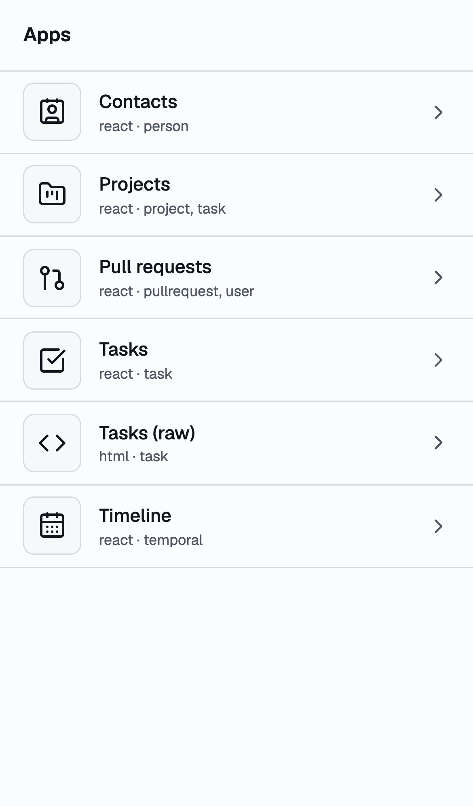
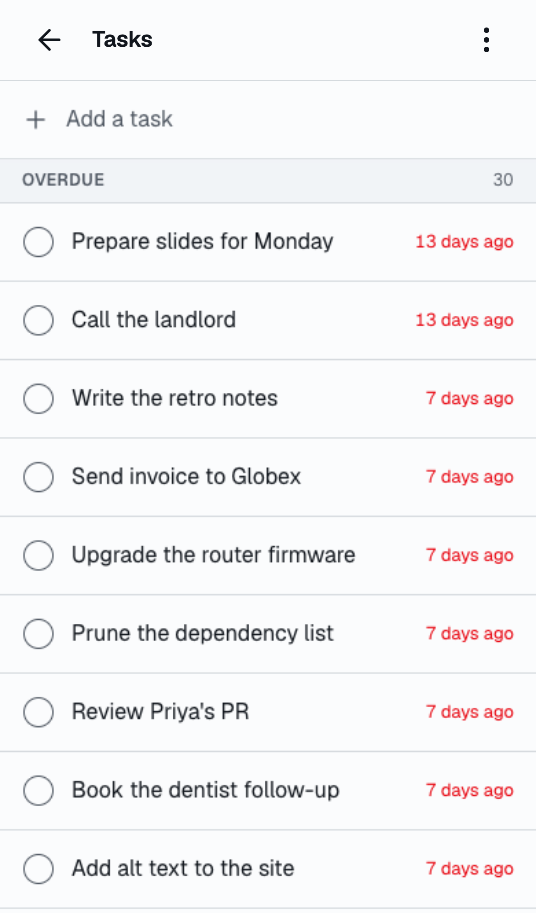

The same app after a check (the row leaves the list) and in dark mode,
inheriting the console's tokens inside the frame:

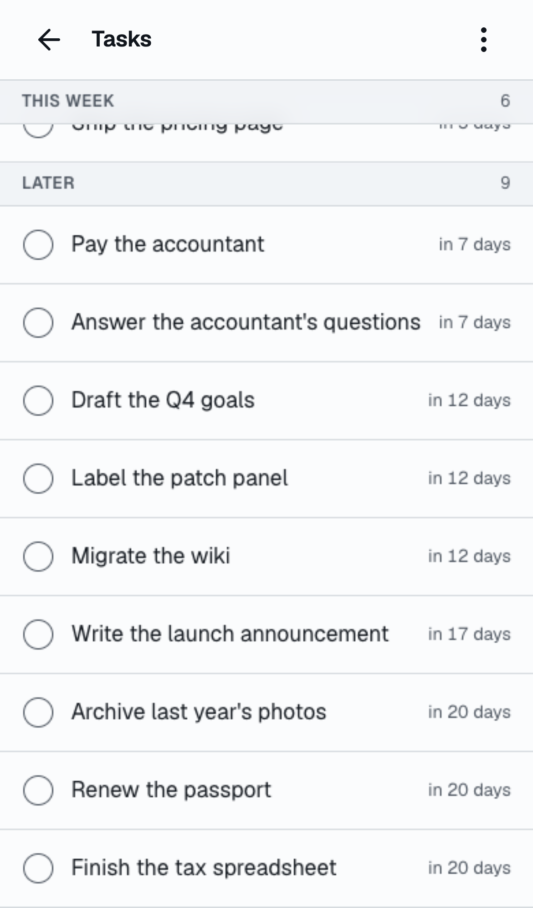
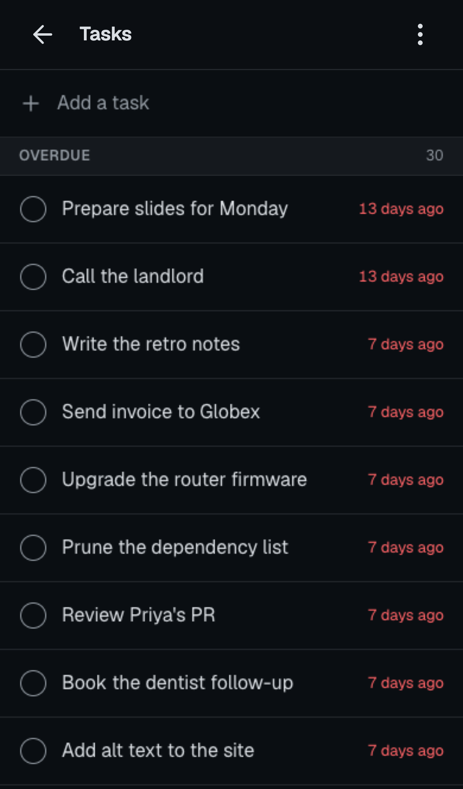

The timeline over the trait's implementors, and contacts with the A–Z rail:

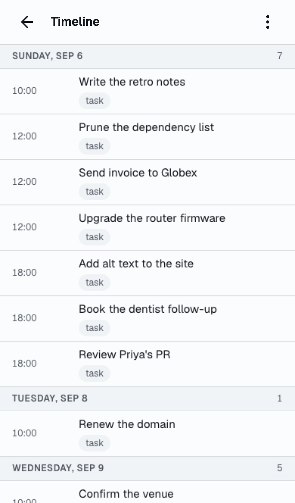
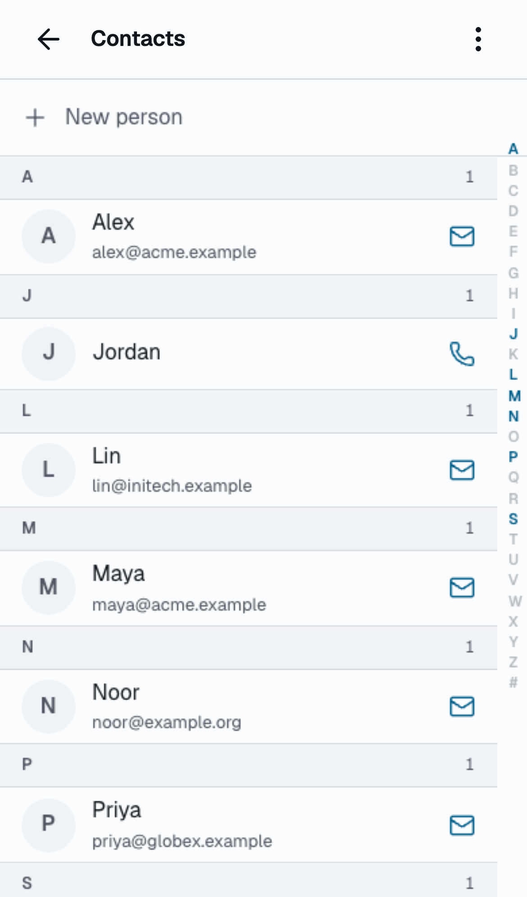

Projects as one document: the list, and the detail it navigates to inside
the app with its own quick add:

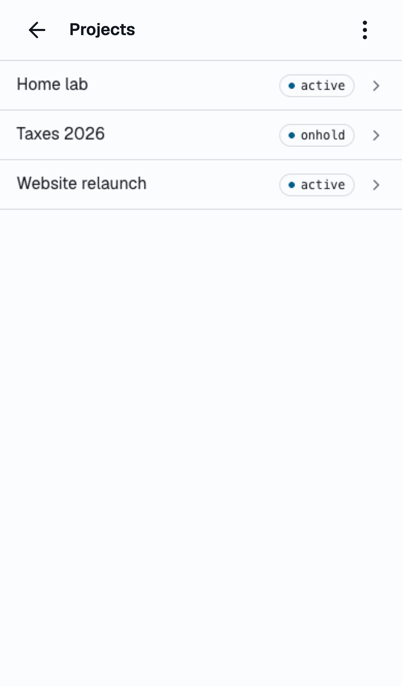
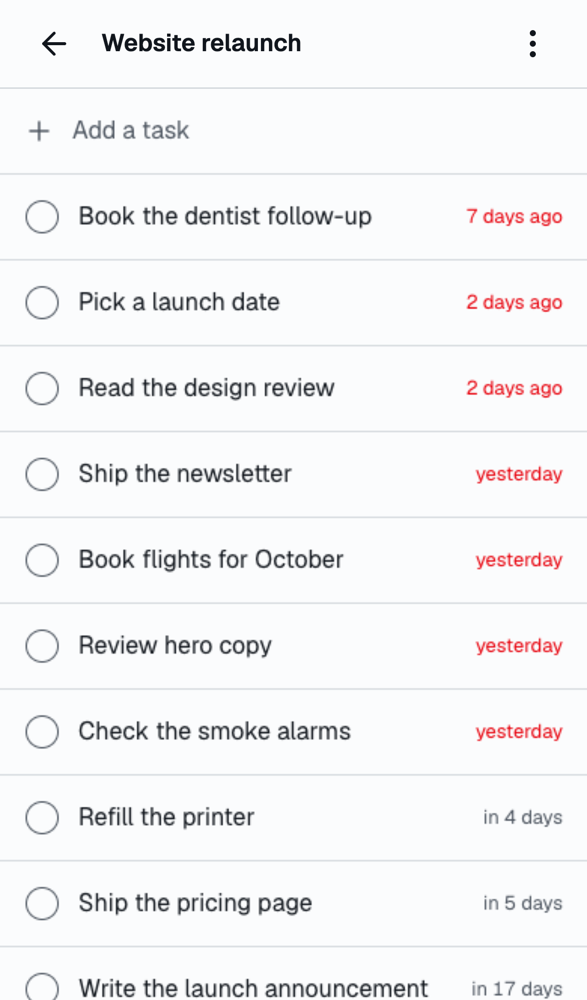

Pull requests over the connected user, and the raw HTML app written without
the kit:

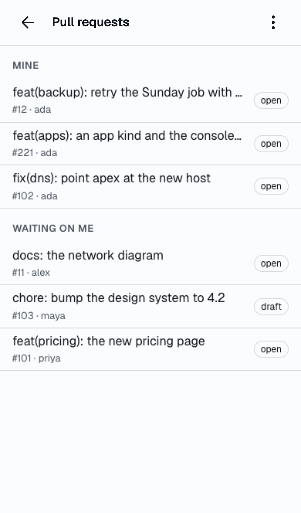
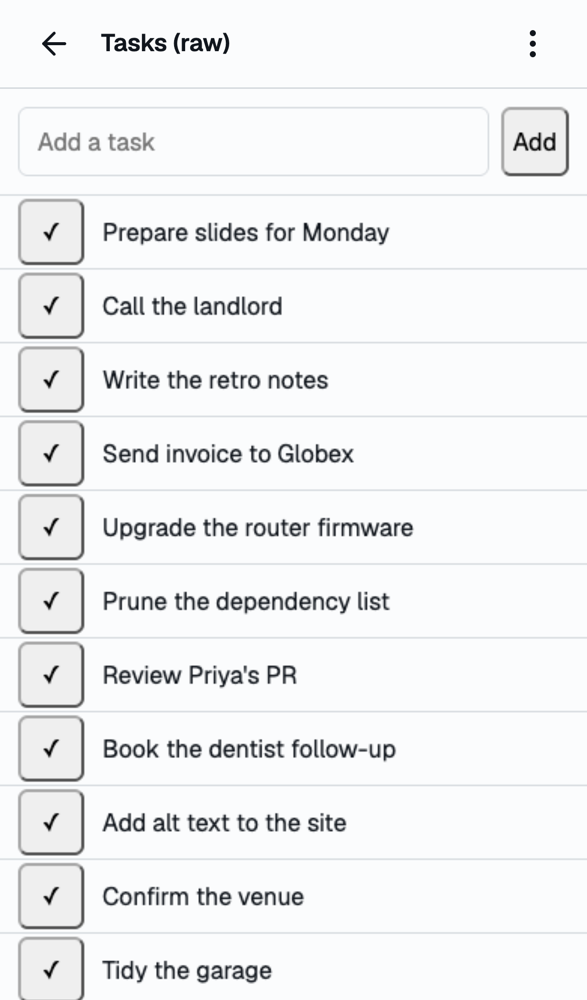

The tasks app as a tab on the task kind's page, and the errors strip naming
the source line of a broken manifest:

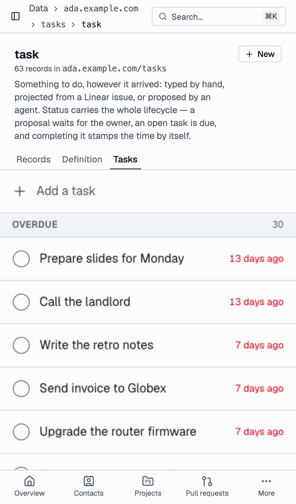
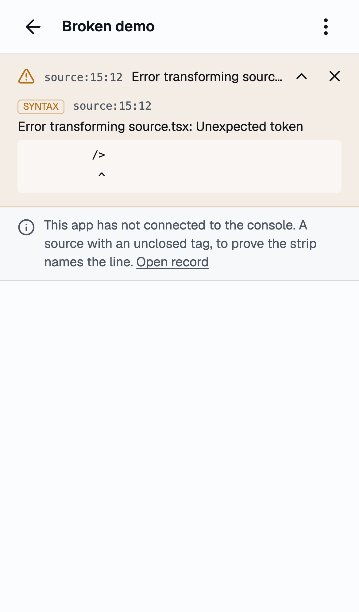

The tasks app on a desktop viewport, inside the console's shell:

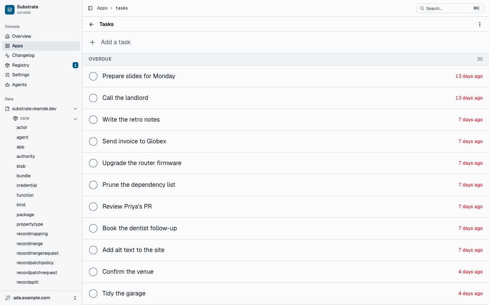
