# Plan: apps — views and apps as records

Status: PROPOSAL, 2026-09-12, with a console prototype on this branch. Written
after a research study (ten prior-art lanes, six codebase maps), a six-design
panel judged through three lenses, an adversarial pass and an independent Codex
review. It is a plan, not a contract: the code that lands is the contract, and
the two kind declarations it proposes sit in `kinds/substrate.reamde.dev/core/`
on this branch so the prototype, this page and the screenshots share one
spelling.

## The ask

Small, mobile-first, single-page apps that use the substrate as their data
layer and are themselves records, the way a function is: a YAML manifest of a
new kind, quick to write by hand and by an agent, with ready-made primitives
(a list, a form, a detail, a timeline, a board, a contact list) and room for
custom components; able to mix kinds, traits, functions and agents; rendered in
the console for now and at a standalone mobile page later. Five apps had to be
easy: tasks (list, add, mark done), a timeline over every temporal record,
contacts over people, projects with their tasks, and GitHub pull requests
involving me and not done.

## What the research found

The raw corpus is forty documents under `.dev/research/` in the worktree that
produced this page (gitignored; ask for it). The digest:

**Four archetypes recur across every system that lets people attach UI to
their data.**

- **A. The card catalog.** A declarative document over a closed set of node
  types the host renders: Home Assistant dashboards, Grafana, Obsidian Bases,
  Notion views, Adaptive Cards, Slack Block Kit, Google's A2UI, Vercel's
  json-render, Lowdefy, Odoo and Frappe views. Two-line cards, one document on
  every screen, editors derived from the node's own declaration, and the
  format agents write best. Its failure mode is the ceiling, which breeds
  string-eval escape hatches (`card-mod`, button-card, Builder.io bindings).
- **B. The sandboxed guest.** Arbitrary HTML behind an iframe on an opaque or
  foreign origin with a host-owned bridge: Figma plugin UI (stable since
  2019), MCP Apps and its hosts (Claude, ChatGPT, VS Code, Goose, Cursor),
  Grist widgets, Retool's JS sandbox, Telegram and Farcaster mini apps,
  Sandstorm and Cozy Cloud. Cheap real isolation and the widest interop; the
  cost is "visual disjointment", a theme/height/handshake protocol every host
  reinvents, and phishing inside the rectangle.
- **C. Remote DOM.** Logic in a worker, a tree of catalog elements rendered by
  the host: Shopify UI extensions, Atlassian Forge UI Kit, WeChat's
  dual-thread model, MetaMask Snaps. Indistinguishable from first-party UI and
  the strongest posture, at the price of a governed catalog implemented once
  per renderer, and it still needs the frame once raw DOM is allowed.
- **D. The userscript.** Code stored beside the data and run with the host's
  privileges: Dataview/Datacore, Home Assistant custom cards, Headlamp, Lens,
  Argo. The ergonomic ceiling, and incompatible with an agent author: an XSS
  is the token, and nothing can be enumerated or gated without running it.

**The 2025–2026 consensus is "catalog by default, code by reference".**
Retool dropped YAML for a JSX DSL and feeds it to the model; Windmill declared
its low-code editor legacy; ToolJet moved AI authoring to granular MCP tools;
Google's A2UI and json-render put an iframe *inside* a catalog for the cases a
catalog cannot draw. GUI-born exports (Appsmith, ToolJet's 12,000-line
template) are things nobody hand-writes.

**Systems that stored UI as rows beside the data for fifteen years converged
on the same split.** Odoo (`ir.ui.view` + `act_window` + menu), Frappe
(DocType-derived views + Workspace), Salesforce (FlexiPage + CustomApplication)
and ServiceNow (macroponent + route) all made the **view**, bound to one kind
and one view type, the unit, and the **app** a thin ordered composition. The
two that made the page the atom produced formats nobody writes by hand
(a trivial ServiceNow page is ~9 kB of JSON).

**Every system that put JavaScript in strings paid later**: Appsmith moved
evaluation to a worker, Retool to a separate-domain iframe, Lowcoder to a
Proxy blacklist, ToolJet never did. Bases shows the second cost, expression
strings inside YAML whose quoting rules become the skill file.

**What the substrate already has** covers every primitive: collection lists
with the filter grammar and keyset cursors, `PATCH` state transitions, `POST`
with an `Idempotency-Key`, cross-kind reads by trait, function and agent call
routes, and a resumable watch stream whose change events name the affected
records (decision 0061), which is exactly the invalidation shape a live view
needs. The console has the transport, the declaration-to-form projection
(`buildFormFields`, `PropertyField`, `RecordConfigForm`), `DataTable`,
`PropertiesRail`, `StateBadge`, `RecordPill`, a bottom `Sheet`, and a YAML
editor that completes and lints any *declared* property.

**Three facts about the tree shape the design more than any precedent.**

1. A declaration's key set is closed (decision 0020) and an object property
   is non-recursive at depth four, so a UI tree is a flat list, one `json`
   property, or text. An app is expressed entirely as a kind's properties.
2. One token is the whole repository, there are no scopes, and the console
   keeps it in `localStorage`. Same-realm custom code is therefore ruled out
   for anything an agent may write, and a per-app scoped token collides with a
   stated rule that has no decision record yet.
3. The engine already carries an admission gate for code: `writer: owner` on a
   property is enforced uniformly, internal writes included
   (`checkPropertyOwnership`, `internal/engine/write.go`). An agent's `mutate`
   lands below owner tier and is refused; its `propose` lands only through an
   owner accept.

Two server defects were found on the way, both in the timeline's path:
`GET /api/v1/occurrences` pins the *shipped* identity of the `recurring`
trait (`internal/api/occurrences.go`), which a sample import rehomes, so the
route answers nothing on a repository built the way this tree prescribes; and
its rule anchor reads `startsAt` then `at`, never `dueAt`, so a recurring task
lands in `problems`. Beside them, the GraphQL `Temporal` interface's `at` is
null for a kind whose point is renamed (`task` binds `temporal(point: dueAt)`,
stored in `due_at`), so a cross-kind timeline must read each kind's bound
point; `docs/traits.md` currently claims otherwise.

## The options, side by side

Six designers wrote complete proposals from six angles; three judges scored
them (60 max) through the owner's lens, the substrate-rules lens and the
builder's lens.

| Angle | What it is | Owner | Rules | Builder |
| --- | --- | ---: | ---: | ---: |
| **View atom + escape hatch** | a `view` kind (kind or trait, layout, filter, order, group, properties, closed verbs), an `app` kind composing views by reference, `layout: custom` behind a guest | 50 | 49 | 49 |
| Record-page first | views and cards attach to kinds and records (OpenShift/Backstage contribution points); an app is a pinned nav entry | 43 | 39 | 45 |
| Catalog purist | the same catalog with no code path at all | 41 | 41 | 43 |
| Agent-native / MCP Apps | apps as UI resources rendered inline in agent threads; the console as an MCP Apps host | 42 | 39 | 40 |
| Code first | an app is one JavaScript module behind the guest with a rich SDK; declarative pieces only as library helpers | 40 | 37 | 39 |
| Function-rendered | the UI is what a Python function returns, HTMX-style | 38 | 31 | 32 |

The winner is the first row with the best of the second and fourth grafted
in: the record-page placement arrives as `attach: [browse, record, home]` on
the same view records, and the MCP Apps bridge is the custom layout's protocol
verbatim, so a custom view renders in other hosts later without change. Code
first lost on authoring speed (the tasks app is 60 lines of code against 24
of data) and on the agent-author threat; function-rendered lost on the
runtime facts (Python only, a 5 s default timeout, a cold start per idle
period, two round trips per tap) and stays as a later complement (`loader:`
functions feeding an ordinary layout).

## The design

### The model: two core kinds

- **`substrate.reamde.dev/core/view`** is the atom: one kind (or one trait,
  across kinds), one **layout** from a closed set the console ships (`list`,
  `board`, `timeline`, `contacts`, `detail`, `form`, `custom`), and its
  filter, order, grouping, visible properties and **actions** as data. It
  renders alone at `/views/{id}`, attaches to the console (`attach:` names
  `launcher`, `browse`, `record`, `home`), scopes to a parent record through
  `via`, opens another view through `opens`, and lists `related` views on a
  detail.
- **`substrate.reamde.dev/core/app`** is the thin composition: a name, an
  icon, an ordered list of **screens** each referencing one view (two screens
  are a segmented control, three to five a tab bar), and the `inputs` its
  views resolve `$input` against, bound like a bundle's (`bindings`, then the
  id `default`, then the sole record).

The declarations are [view.yaml](../../kinds/substrate.reamde.dev/core/view.yaml)
and [app.yaml](../../kinds/substrate.reamde.dev/core/app.yaml); read them, they
are the contract. Both are core rather than a sample because a provider's
shipped view must name a kind whose identity is the same in every repository
(decision 0048 rehomes samples and never providers), and the console needs one
address; the user loses no door because `layout: custom` is it. Neither joins
the engine's system kinds, so a token writes their records like a trigger's.
Two field names departed from the panel's text because the loader reserves
`title` on every level: a screen carries `label`, a related section `heading`.

**Actions are eight closed verbs**: `create`, `transition`, `patch`, `delete`,
`call` (a function), `chat` (an agent), `open` (another view), `link` (a
`url`-typed property of the row, a property NAME, never a template). Each has
a `placement` (`primary`, the screen's one bottom button; `header`; `row`), an
optional `when` over one property, `prompt`/`set` for what a create or patch
asks for and writes silently, a `description` shown on hover and in the
confirmation, and `confirm` to ask first. A transition is hidden while the
machine does not admit it.

**Runtime narrowing is `facets`**, never a stored filter: a list of state,
enum or reference properties the person may narrow the rows by while looking,
offered as chips (declared values for a state or enum, the referents present
in the loaded rows for a reference), ANDed into the request and kept in the
URL so a narrowed screen is shareable. A timeline's date range is the same
idea for time: quick ranges and a custom span, overriding `window` on the
client and living in the URL, never written back to the view.

**There is no expression language.** Text is `displayTemplate`'s grammar,
which the engine already validates at admission; a list is the wire filter as
data; visibility is a data-shaped `when`; and the binding vocabulary is two
tokens: `$input.<name>` (the bound record's path) and `$record` (the clicked
row's path, valid only where a row exists: a row action, a detail), each with
one property hop (`$input.me.login`, `$record.project`) as `displayTemplate`
allows. `$record` is what a `verb: call` needs to hand the row to a function;
a `set` on a `call` is validated against the callable's arguments, on a
create or patch against the kind's properties. A string beginning with `$$`
is a literal. CEL waits until a view needs a computed value, and a decision
record (0076) pins that.

**Roles derive from the declaration.** The title is the server's `title`, the
badge is the sole `state` property (shown only when the filter admits more
than one state), the instant is the `temporal(point: X)` binding, a `mailto:`
comes from an `email`-typed property, the avatar is the title's initials. An
author names what matters (`show`, `groupBy`, `prompt`) and never how to
draw it.

### The five examples

Exactly as applied on the dev substrate (`.dev/seed/views.yaml`), against the
rehomed references of a repository named `ada.example.com`. One
`substratectl apply -f` each; 12 to 28 lines per document.

**Tasks: list open, add one, mark done.**

```yaml
kind: substrate.reamde.dev/core/view
metadata:
  id: tasks-open
data:
  properties:
    name: Open tasks
    layout: list
    kind: ada.example.com/tasks/task
    attach: [launcher, browse]
    filter:
      properties:
        status:
          in: [open, proposed]
    groupBy: dueAt
    show: [dueAt, priority, project]
    facets: [priority, project, assignee]
    empty: Nothing open.
    actions:
      - name: done
        verb: transition
        to: done
      - name: add
        verb: create
        label: Add task
        prompt: [name, dueAt]
```

`in: [open, proposed]` because the grammar has no `ne`. Order defaults to the
temporal point. `facets` puts priority, project and assignee chips under the
header, so "high-priority tasks in the website project" is two taps and a URL. `done` is `PATCH {"properties":{"status":"done"}}` with the
row's version as the precondition, which stamps `completedAt`; the row leaves
the list and a toast offers Undo through the declared `done → open` arm. `add`
is the screen's primary button and opens a bottom sheet with the declaration's
own controls. `groupBy: dueAt` sections Overdue / Today / Tomorrow / This week
/ Later / Undated.

**Timeline of every temporal record.**

```yaml
kind: substrate.reamde.dev/core/view
metadata:
  id: timeline
data:
  properties:
    name: Timeline
    layout: timeline
    trait: substrate.reamde.dev/core/temporal
    attach: [launcher, home]
    window:
      past: P7D
      future: P30D
```

The prototype reads the trait's implementors, then one windowed list per
implementor ordered on its own bound point (`dueAt` for a task, `at` for an
event), merged and grouped by local day. v1 collapses it to one request once
the trait records route takes `from`, `to` and `first` and `at` coalesces to
the bound point (decision 0079 below).

**Contacts over people: two views and a two-screen app.**

```yaml
kind: substrate.reamde.dev/core/view
metadata:
  id: people-contacts
data:
  properties:
    name: Contacts
    layout: contacts
    kind: ada.example.com/people/person
    attach: [browse]
    filter:
      properties:
        prominence:
          eq: known
    show: [emails, phones, memberOf]
    facets: [relationship]
    first: 500
    actions:
      - name: add
        verb: create
        prompt: [name, emails, phones]
      - name: demote
        verb: transition
        to: utility
        label: Hide
        description: Moves this person out of your contacts; they stay in
          people and can be added back from the Others screen.
        confirm: true
---
kind: substrate.reamde.dev/core/view
metadata:
  id: people-others
data:
  properties:
    name: Others
    layout: contacts
    kind: ada.example.com/people/person
    filter:
      properties:
        prominence:
          eq: utility
    show: [emails, relationship]
    empty: Nobody is hidden.
    actions:
      - name: promote
        verb: transition
        to: known
        label: Add to contacts
        description: Makes this person a contact.
---
kind: substrate.reamde.dev/core/app
metadata:
  id: contacts
data:
  properties:
    name: Contacts
    icon: contact
    screens:
      - name: known
        label: Contacts
        view: people-contacts
      - name: others
        label: Others
        view: people-others
```

A–Z sections with an index rail, initials avatars, `mailto:` from `emails` by
datatype, a local filter box. The create is seeded `prominence: known` from
the filter's `eq`, which is how a new contact is born known. The sheet
requires what the declaration requires plus one heading alternative the
template reads that the author prompted for (`name` here, since the template
is `{displayName|name}`); it never adds a field the author did not prompt.
`Hide` asks first and says what it does; the Others screen is where a hidden
person comes back from, which is the whole reason the app has two screens.

**Projects with their tasks: three views.**

```yaml
kind: substrate.reamde.dev/core/view
metadata:
  id: tasks-by-project
data:
  properties:
    name: Open tasks
    layout: list
    kind: ada.example.com/tasks/task
    via: project
    attach: [record]
    filter:
      properties:
        status:
          in: [open, proposed]
    show: [dueAt, priority]
    actions:
      - name: done
        verb: transition
        to: done
      - name: add
        verb: create
        prompt: [name, dueAt]
---
kind: substrate.reamde.dev/core/view
metadata:
  id: tasks-project
data:
  properties:
    name: Project
    layout: detail
    kind: ada.example.com/tasks/project
    show: [summary]
    related:
      - view: tasks-by-project
    actions:
      - name: pause
        verb: transition
        to: onhold
      - name: resume
        verb: transition
        to: active
      - name: done
        verb: transition
        to: done
---
kind: substrate.reamde.dev/core/view
metadata:
  id: tasks-projects
data:
  properties:
    name: Projects
    layout: board
    kind: ada.example.com/tasks/project
    attach: [launcher]
    groupBy: status
    filter:
      properties:
        status:
          in: [active, onhold]
    opens: tasks-project
    actions:
      - name: add
        verb: create
        prompt: [name]
```

`via: project` is Bases' `this`: opened under a project the list ANDs
`project eq <path>` and its create prefills `project`; `attach: [record]`
mounts the same list as a card on every project's generic record page. The
board's columns are the states the filter admits; on a phone they are a
segmented control over one list. The three transitions render where the
machine admits them.

**GitHub pull requests involving me, not done.** The mirror is already
involvement-scoped (`involves:<login>`), so the filter is state plus account,
and "me" is an app input resolved to the sole connected GitHub **user** mirror,
which carries both the `login` and the `account` it was synced through (the
account record's own `login` is connector-written and empty until the first
sync, so it is the wrong record to key on). Ordered by `updatedAt` until
provider version 11 ships `activityAt` (GitHub's own `updated_at`; the
mirror's `updatedAt` shadows the row's column and orders by sync time) and
`assigneeLogins` (for an "Assigned" screen; today assignees sit only in
`raw`).

```yaml
kind: substrate.reamde.dev/core/view
metadata:
  id: github-prs-involving
data:
  properties:
    name: Involving me
    layout: list
    kind: providers.substrate.reamde.dev/github/pullrequest
    filter:
      properties:
        state:
          in: [open, draft]
        account:
          eq: $input.me.account
    orderBy:
      - property: updatedAt
        desc: true
    groupBy: repository
    show: [number, state, authorLogin, updatedAt]
    actions:
      - name: github
        label: Open on GitHub
        verb: link
        href: htmlURL
---
kind: substrate.reamde.dev/core/view
metadata:
  id: github-prs-mine
data:
  properties:
    name: Mine
    layout: list
    kind: providers.substrate.reamde.dev/github/pullrequest
    filter:
      properties:
        state:
          in: [open, draft]
        account:
          eq: $input.me.account
        authorLogin:
          eq: $input.me.login
    orderBy:
      - property: updatedAt
        desc: true
    groupBy: repository
    show: [number, state, updatedAt]
    actions:
      - name: github
        label: Open on GitHub
        verb: link
        href: htmlURL
---
kind: substrate.reamde.dev/core/app
metadata:
  id: github-prs
data:
  properties:
    name: Pull requests
    icon: git-pull-request
    inputs:
      me:
        kind: providers.substrate.reamde.dev/github/user
        description: the connected GitHub user; its login and account scope
          every screen
    screens:
      - name: involving
        label: Involving me
        view: github-prs-involving
      - name: mine
        label: Mine
        view: github-prs-mine
```

With one connected user the input resolves to the sole record and nobody is
asked; with two, the first open shows the picker and writes `bindings.me`.
Before the first sync there is no user mirror at all, so the screens render
their empty state with the input named. Until the provider is installed the
launcher lists the app greyed with "needs providers.substrate.reamde.dev/github".

### The one escape hatch: `layout: custom`

A custom view carries `source`, one HTML document of the MCP Apps resource
type (`text/html;profile=mcp-app`), and `permissions` (reads, writes, call,
agents) as references, exactly as a function declares its grant. The console
mounts it as `<iframe sandbox="allow-scripts" src="/app-frame">`: no
`allow-same-origin`, so the origin is opaque, `localStorage` throws, and a
`fetch` to `/api` carries `Origin: null` and is refused because `/api` answers
no CORS. The shell at `/app-frame` receives one `MessagePort` and the HTML,
writes an import map naming `substrate/app`, and the document talks to the
console over JSON-RPC with MCP Apps' message vocabulary: `ui/initialize`
returning `hostContext` (theme tokens, display mode, safe areas), the
`ui/notifications/initialized` lifecycle step, `ui/notifications/tool-result`
pushing the view's own filtered page on every change, `tools/call` for
`substrate.records.list/get/put/patch/delete` checked per call against the
declared grant, `ui/notifications/size-changed`, `ui/open-link` (host
confirmed, `http`/`https`/`mailto` only, the one intentional outbound
channel), and a handful of `substrate/*` methods for the mobile chrome
(primary action, back, navigate) a foreign host ignores. The shell keeps the
transferred port in code that survives `document.open()`, which erases the
document's listeners. The guest's CSP is `default-src 'none'; script-src
'self' 'unsafe-inline'; style-src 'unsafe-inline'; img-src data: blob:;
connect-src 'none'; worker-src 'none'; frame-src 'none'`, the same policy in
the dev meta tag as in the production header, because `connect-src` alone
leaves an image URL as an exfiltration path. A custom view can reach the
substrate only through the bridge and the internet not at all. "Renders in
other MCP Apps hosts" is a compatibility of vocabulary, not a promise: a
foreign host needs a `postMessage` transport adapter and the SDK packaged as a
resource, both later work. `source` is `writer: owner`: an agent may write
every declarative view and app it is granted, but code lands only under the
owner's own hand or through an accepted proposal, and no shipped closure
carries browser code.

The SDK is small on purpose: `createApp()`, `app.onRecords(cb)`,
`app.records.{list,get,put,patch,delete,transition}`, `app.navigate`,
`app.openLink`, `app.primaryAction.{set,onClick}`, `app.back.onClick`,
`app.notifySizeChanged()`, and later `functions.call`, `agents.chat`,
`watch`. Absent, not refused: GraphQL, `fetch`, tokens, vocabulary, blobs.

### Functions and agents from a view

`verb: call` reads the function record's flat `arguments` and builds the same
bottom sheet a record form uses, confirms when the function's `confirmation`
is `always` or its `effect` is `external` or `irreversible`, posts to the call
route with an idempotency key, and invalidates the function's `writes` kinds
when effects landed. `verb: chat` opens the console's chat on the named agent
with `message` rendered from the row, reusing the transcript components
unchanged. An app declares no trigger: a package ships `triggers.yaml` beside
`views.yaml` in one install, so automation beside the UI is the bundle's job.

Mid-conversation, an agent whose `permissions.writes` names `core/view` writes
a view with `mutate`, and the tool card in the thread renders it inline off
the call's `changes` stamp, the way an `ask` renders its interaction card;
from that moment the view is a record with a URL, a version and an owner.

### Security, in five lines

The token never crosses the bridge and never reaches a declarative view,
which executes nothing of the author's. `link` is the one declarative verb
that could carry bytes out of the origin, so `href` is a property name
resolved to a `url` the record already holds. A custom view's grant is
enforced per call and honored only when `source`, `permissions`, `kind` and
`filter` were ALL last written at owner tier (`propertyMeta` on the single
read; a list omits it), because only `source` carries `writer: owner` and an
agent allowed to write views could otherwise widen the grant or repoint the
page under an owner-written document. Below that bar the guest mounts with no
data and no RPCs: synthetic records for a preview and a "needs the owner's
review" line, never a "dry run" that reads. The port is revoked when the row
changes under a mounted guest. Against the owner's own token the grant is
advisory until a scoped token exists. Do not add CORS to `/api`.

### Versioning

`view.kind` is a reference without `mustExist`, so a view survives the
absence of its package and the console gates on presence (the install offer
in place of the empty state). `requiresAtLeast` keyed by package identity is
the floor, as on a bundle (decision 0070). The engine's narrowing guards
protect stored values, not a view's references: a property no record holds
may be dropped or renamed while a view still names it, so the live semantic
check (in the console now, in the engine's admission gate at v1) is the
authority after every vocabulary change, and a stale name is a status problem
in the header, never a crash. Rewriting view rows on a `renamedFrom` is a
later widening of decision 0063 over every site that names a property
(`show`, `orderBy`, `groupBy`, `via`, `prompt`, `when`, `set` keys,
`actions[].property`, the filter's keys, the token hops). Layouts, verbs,
placements and attach points are permanent once shipped, because a live row
makes their removal a narrowing the upgrade refuses; a value enters the enum
in the commit whose renderer lands. A record's `kindVersion` says which
declaration last wrote it, not which renderer. Shipped views are upserts under
their package, merged and never pruned, and an owner edits a shipped view by
duplicating it. A put merges, so removing a line from a view in the YAML
editor keeps the old value: a removal is written as `groupBy: null`, and the
authoring page says so.

### The mobile shell

The route is the stack: `/apps/{id}/{screen}/{record?}` and
`/views/{id}/{record?}`, where the record segment carries the full path (kind
and id, percent-encoded as one segment) because a trait view spans kinds and
a bare id cannot be reopened after a reload; back is history, every sheet
pushes an entry so a back press closes the sheet before it pops the route,
and a visited-view guard stops `opens` and `related` from mounting a cycle. Under 768 px the console
hands the screen to host-owned chrome: a header with title and back, a
segmented control for two screens or a tab bar for three to five, one primary
button above the safe area, the existing bottom `Sheet` for the record sheet,
forms, confirms and chat. A row's first action is a trailing 44 px button and
the rest sit in a hold menu; no horizontal swipe carries meaning. The root
gains `viewport-fit=cover` and a `html.touch` density (16 px, wider spacing)
toggled on app routes, because Tailwind's `rem` utilities resolve against the
root. Standalone arrives as `/m/apps/{id}` outside the shell and a PWA
manifest; same origin, same bundle, no CORS.

### Authoring by agents

A model is given `docs/apps.md` (the two declarations by reference, the seven
layouts and what each needs, the eight verbs, the one token, the five
examples, and a Farcaster-style checklist: no `type`, no `apiVersion`, `in`
for "not done", a state moves by `transition`, `contains` is membership,
`href` is a property name, `source` is not yours to write). The server
validates the envelope, enums and reference kinds with path-shaped problems;
the console adds what only the target kind or the composition knows
(`show[1]: "prority" is not a property of …/task (did you mean priority)`),
and `apply` is hot reload because the watch on `core/view` re-renders the
open screen.

### Runtime, in one paragraph

A page reads the registry once, the view record, projects it to a spec with
path-shaped problems, compiles the spec to the console's own query options
(an infinite keyset walk for a list or contacts, one page for a board or a
timeline with an explicit "more not loaded" line when a cursor remains, one
windowed list per implementor for a trait view), and renders cells by
datatype with the components the record page already uses. One watch tail per
tab covers the union of every mounted view's kinds plus `core/view` and
`core/app`; each change row's `affected` records invalidate their queries,
and the first "live" signal refetches once, so a write between a list and the
stream opening is never missed. Writes carry the row's version as the
precondition, an `Idempotency-Key` per pending form, and an optimistic
rewrite of the cached page with Undo through the declared return arm; a 409
refetches. Under a bundle-style resolution an input is bound, then `default`,
then the sole record, and a binding whose record is gone is reported, never
silently replaced.

## What the independent Codex review changed

Codex (read-only, against the tree) kept the architecture and found one
blocker and ten majors; the accepted ones are folded in above:

- the custom view's grant is honored only when `source`, `permissions`,
  `kind` and `filter` are all owner-written, and a guest below that bar gets
  no data (the "dry-run" is gone);
- `$record` joins `$input` so a function action can name its row, `set` is
  validated per verb, and `$$` escapes a literal;
- the record route segment carries kind and id; nested view mounts carry a
  cycle guard;
- the dev guest policy equals the production one (`img-src` was a hole),
  `ui/open-link` is named as the one outbound channel, and the port survives
  `document.open()`;
- "renders in other MCP Apps hosts unchanged" became a vocabulary
  compatibility with an adapter owed;
- the live handoff refetches on the first "live" signal, boards and timelines
  say when a page was cut, dangling bindings are preserved;
- the create sheet's required rule and the put-merges hot-reload example were
  corrected; versioning states that narrowing guards protect values, not
  view references, and the rename inventory gained `actions[].property`.

Deferred rather than rejected: a boolean `when`, `in` versus `exists`
exclusivity, and per-column board paging wait for the first user who needs
them.

## The prototype on this branch

Three things to look at, from the same view records, so the comparison is
placement and boundary rather than data:

- **P1, views and apps** (recommended): `/apps`, `/views/tasks-open`,
  `/views/tasks-projects`, `/views/people-contacts`, `/views/timeline`,
  `/apps/github-prs`, with host chrome under 768 px.
- **P2, the console is the app**: the same records as a Views tab on a kind's
  page, an "Open tasks" card on a project's record page, the timeline as a
  card on the overview, and a bottom tab bar for the launcher entries on a
  phone.
- **P3, the guest**: `/views/tasks-heatmap`, a custom layout drawing from the
  page the host pushes, behind the sandboxed frame.

### What is built

Everything below runs against the dev substrate with no server change beyond
the two core declarations. The console code is under
`web/console/src/lib/apps/` (the spec, the problems, tokens, inputs, the
`when` matcher, queries, actions, referents, grouping, the state machine
helpers), `web/console/src/components/apps/` (the renderer, the seven
layouts, the record sheet, the create sheet, row actions, the app chrome,
the input binder, the bottom tab bar, the guest), `web/console/src/pages/`
(`apps`, `app`, `view`), `web/console/src/frame/` and `app-frame.html` (the
guest shell) and `web/console/src/apps-sdk/` (the `substrate/app` module).
Routes: `/apps`, `/apps/{id}/{screen}[/{record}]`, `/views/{id}[/{record}]`,
each under host chrome below 768 px and inside the console's shell above it.
The console's typecheck, lint, formatter, 957 tests and build pass.

- **P1.** The launcher, the five example apps, the app chrome (back, title,
  a segmented control for two screens, one primary button above the safe
  area), the record sheet (a tap pushes one history entry, closing pops it,
  back closes an open sheet first), the create sheet with the declaration's
  own controls, transitions with an Undo toast through the declared return
  arm, confirmations that show the action's `description`, idempotent
  creates, the live tail (one per tab, refetch on the first live signal),
  facet chips kept in the URL (`?f.priority=high`), a timeline date range
  (quick ranges and a custom span, `?from=&to=`), inputs resolved bound →
  `default` → sole with a preserved "missing" state, `$input` and `$record`
  tokens, presence gating, and status problems written for a person.
- **P2.** `attach: browse` as a tab on the kind's page, `attach: record` as a
  card on the record page scoped through `via`, `attach: home` as cards on
  the overview, and a phone bottom tab bar listing the launcher entries.
- **P3.** `/views/tasks-heatmap`: the guest shell, the same CSP in dev and
  production, the bridge with per-call grant checks, the SDK, and the
  owner-provenance gate (a view below owner tier mounts nothing). Verified in
  the browser: no `localStorage`, no `fetch` to `/api` or to the internet,
  the console's tokens and fonts inside the frame, a redraw within half a
  second of a change made through the CLI.

Not built, on purpose: `/m/apps/{id}` and the PWA manifest, the hold menu
for further row actions (an overflow button stands in), offline disabling,
the `call` and `chat` verbs (toast stubs), the engine admission gate, shipped
`views.yaml` in the sample packages, and any of the server changes listed
below.

### Run it

```bash
SUBSTRATE_DEV_PORT=8090 mise run dev:up          # the substrate, with the two kinds seeded
cd web/console && VITE_PROXY_SUBSTRATE=http://localhost:8090 pnpm dev
bin/substratectl import samples.substrate.reamde.dev/{people,scheduling,tasks,calendar}
bin/substratectl install providers.substrate.reamde.dev/github
bin/substratectl apply -f .dev/seed/demo.yaml -f .dev/seed/views.yaml
```

Then open `http://localhost:5173/apps` at a phone width. The seed files live
in the worktree's gitignored `.dev/seed/`.

### The sixth example: a standalone form

```yaml
kind: substrate.reamde.dev/core/view
metadata:
  id: tasks-add
data:
  properties:
    name: Add a task
    layout: form
    kind: ada.example.com/tasks/task
    filter:
      properties:
        status:
          eq: open
    actions:
      - name: add
        verb: create
        label: Add task
        prompt: [name, dueAt, priority, project]
```

### Screenshots (iPhone 13 viewport unless noted)

The launcher, and the tasks list with its facet chips, its Overdue section,
Done as the row action and Add task as the primary button:

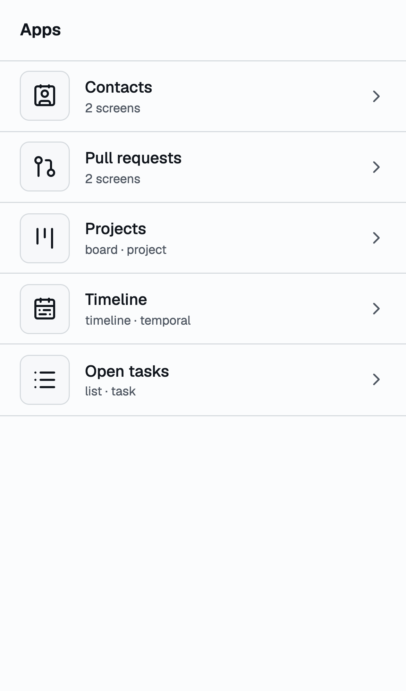
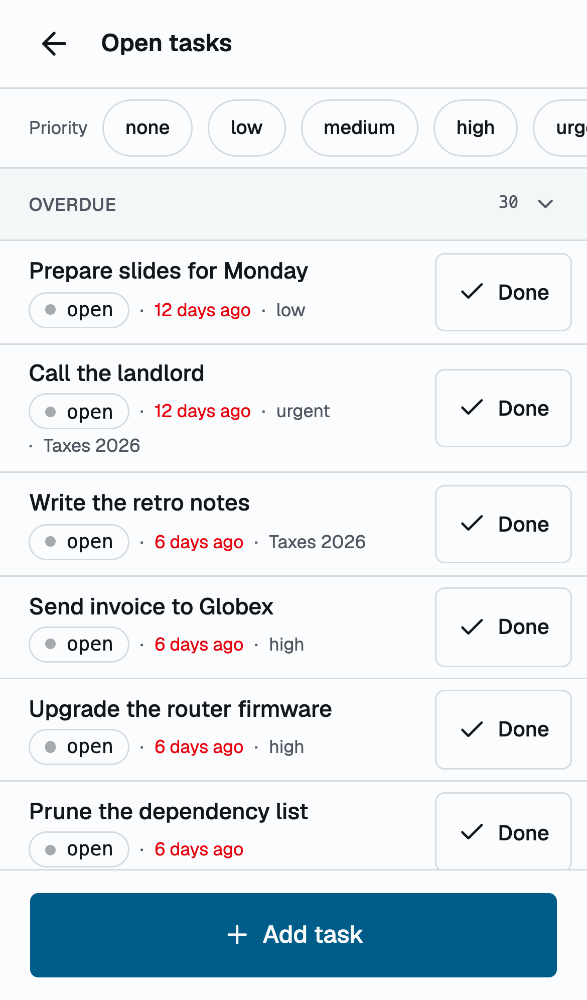

The same list narrowed to `?f.priority=high` through the chips, and the
create sheet the declaration produced from `prompt: [name, dueAt]`:

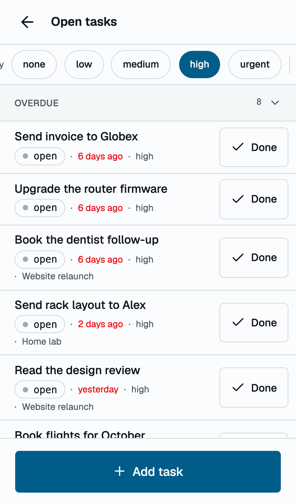
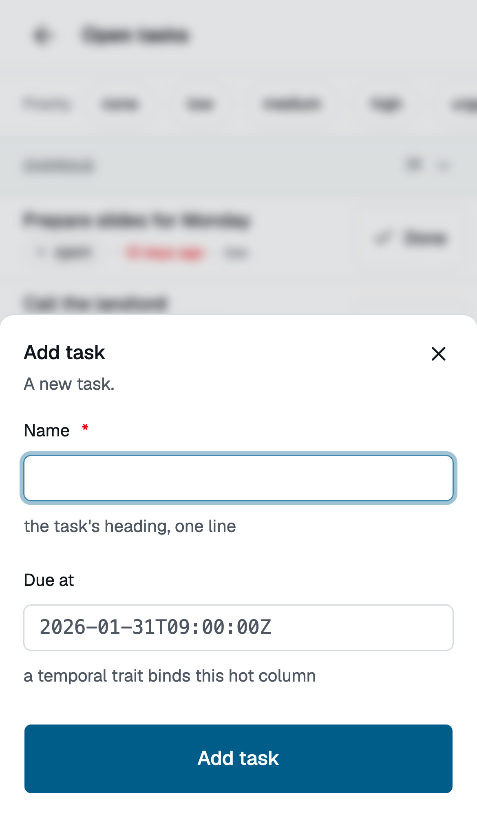

The timeline interleaving calendar events and tasks under day headers, and
the same view with its range set to the next three months:

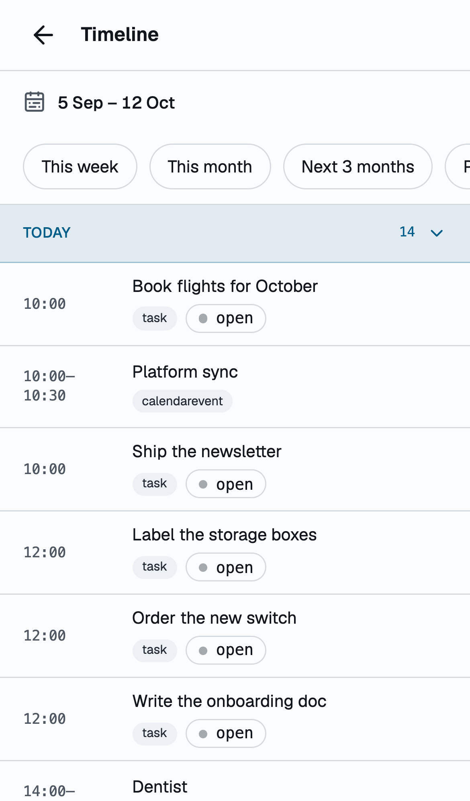
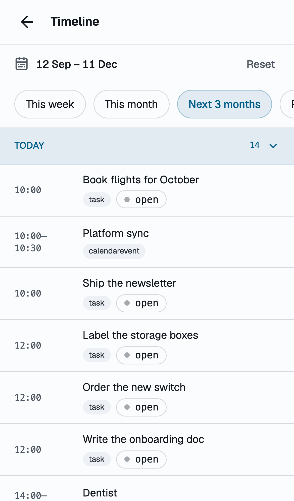

The Contacts app: the known people with A–Z sections, an index rail,
`mailto:` links and Hide as the row action, and its Others screen with
"Add to contacts":

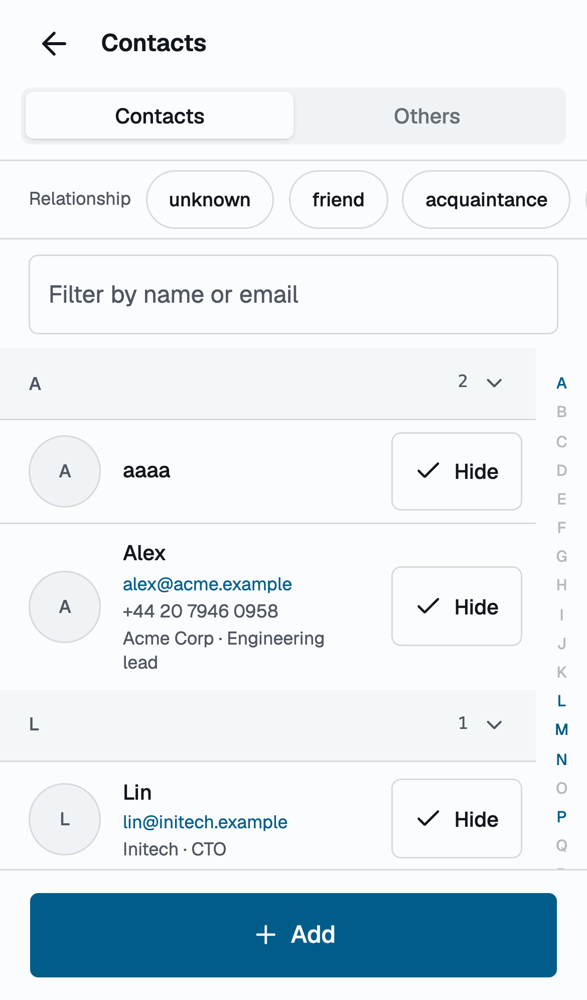
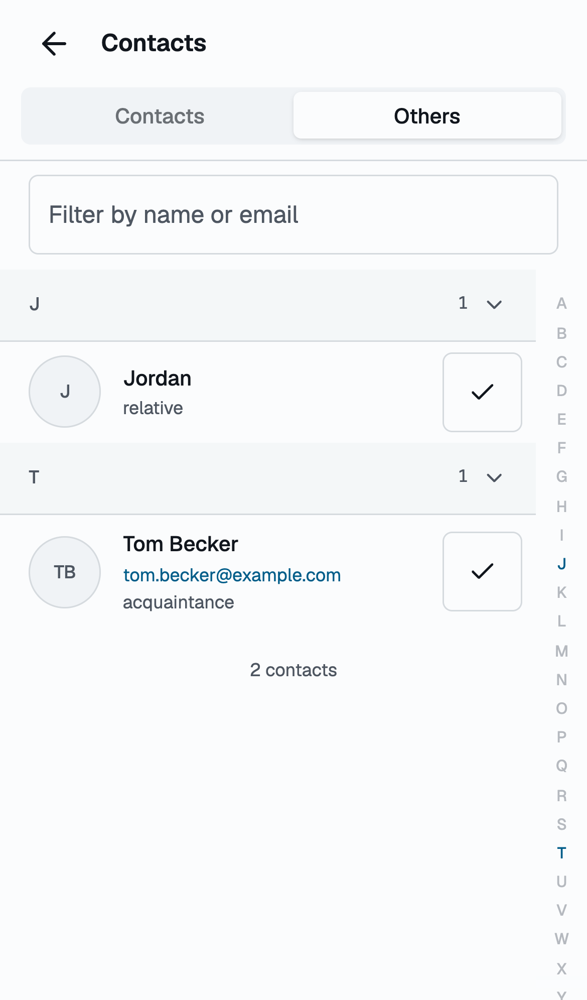

The projects board as a segmented control over one list, and a project's
detail with the admitted transitions and the scoped "Open tasks" section:

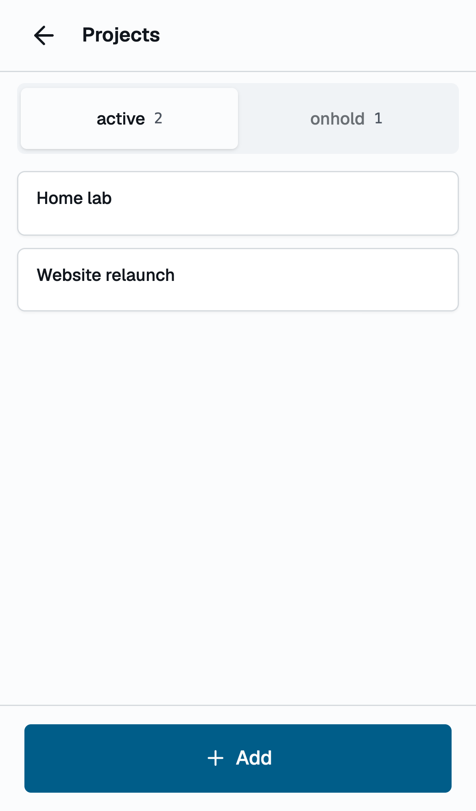
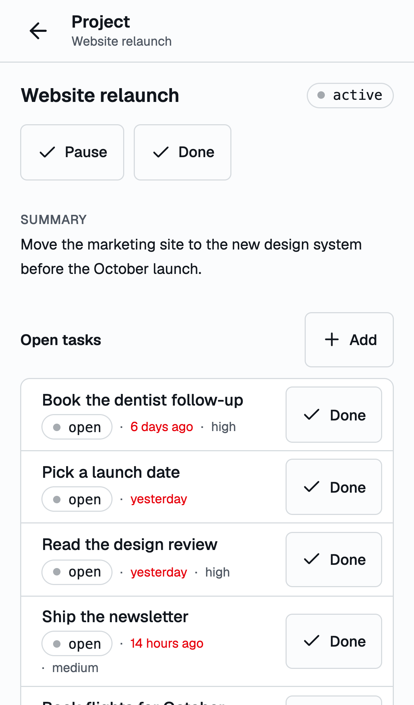

The GitHub app's two screens over the connected user, with the one plain
status line about ordering:

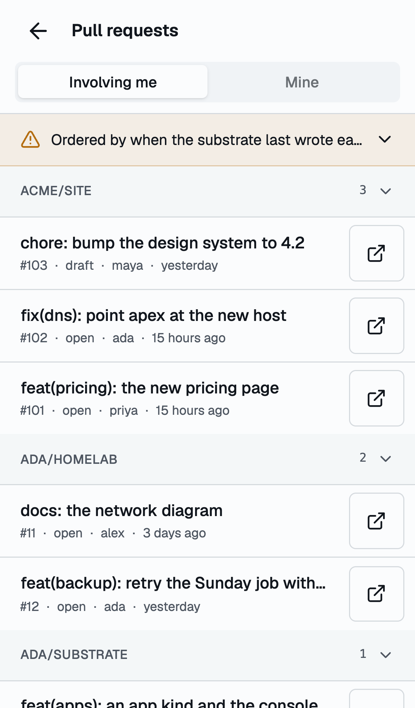
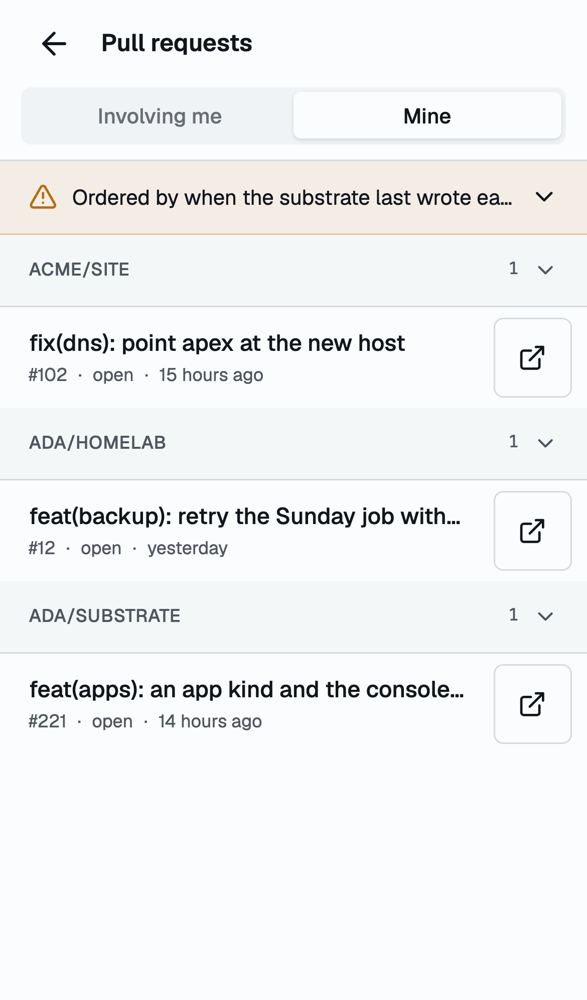

P2, the same tasks view as a tab on the kind's page with the bottom tab bar,
and the overview with the view cards; P3, the custom heatmap drawn by the
guest from the page the host pushed:

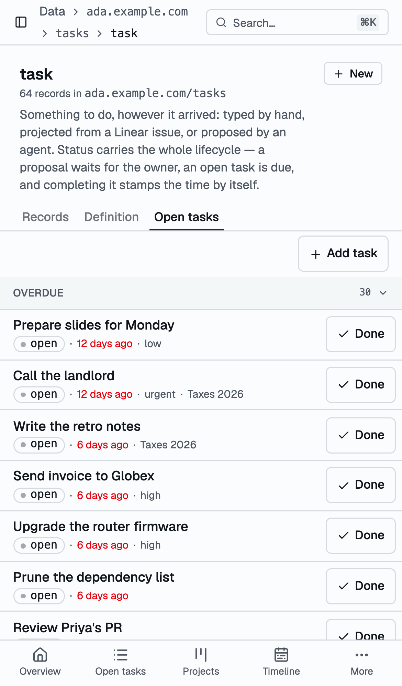
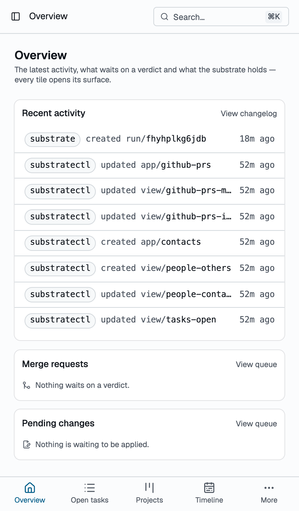
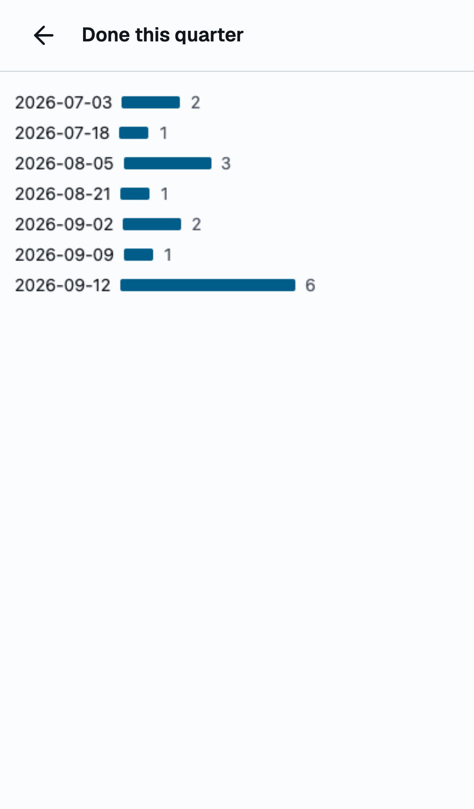

The tasks view on a desktop viewport, inside the console's shell:

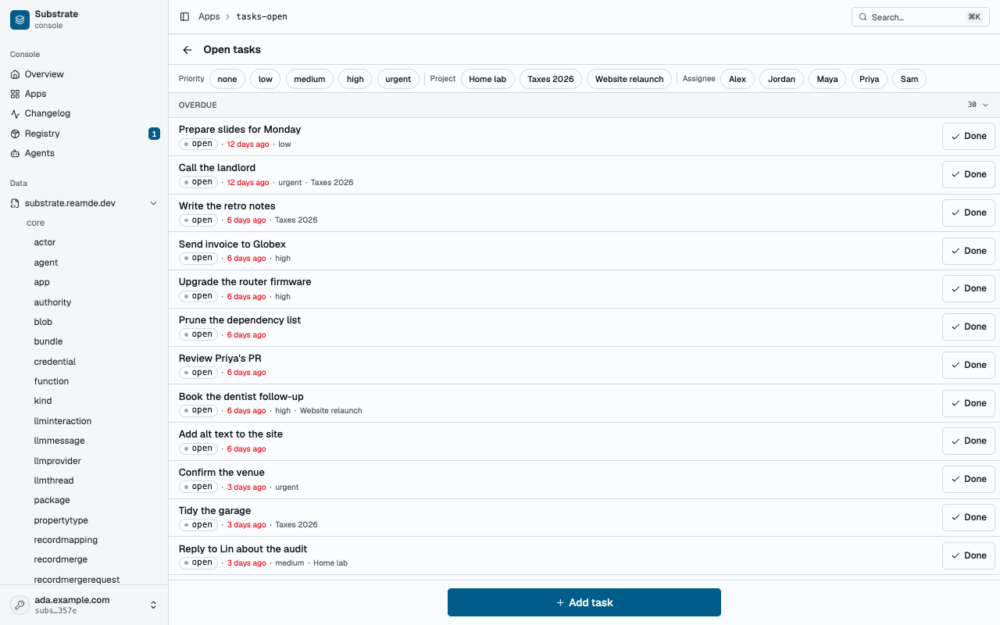

## Server changes owed (none for the prototype)

1. `GET /app-frame` beside `/healthz`, serving the guest shell under its own
   CSP; the host CSP on the SPA, report-only for one release;
   `Access-Control-Allow-Origin: *` under `/assets/` for the SDK module and
   fonts.
2. An admission gate for view rows in the engine on the trigger's pattern
   (a layout contract unmet, a `to` that is not a state, a `set` or `prompt`
   on a `writer:`-restricted property, an `href` that is not `url`-typed, a
   `source` over 256 KiB), with `problemDetails`.
3. `status.inputs` on the app row, resolved by the engine's own input
   resolution generalized over any row carrying `inputs`.
4. The trait records route taking `from`, `to` and `first` over the bound
   point; `at` coalescing to the bound point for `temporal(point: X)` kinds;
   the `/occurrences` trait pin and `dueAt` anchor; `docs/traits.md`
   corrected.
5. GitHub provider version 11: `assigneeLogins` and `activityAt`, with
   `updatedAt` and `createdAt` deprecated.
6. `views.yaml` shipped beside the kinds it renders (`samples/tasks`,
   `samples/people`, `samples/calendar`, the GitHub provider), each package
   version moved by one, and a `kinds:check` rule that a new data document
   moves its package version.
7. Words: **view**, **app**, **screen**, **layout**, **verb**, **guest**,
   **bridge** in `docs/terms.md`; **input** and **bind** widened to an app's.

## Decision records owed

- **0076** Expressions in a view are the template grammar, the filter grammar
  as data, a one-property `when` and the `$input` token; no evaluator in v1.
- **0077** The view is the atom and the app composes views by reference; both
  are core kinds; layouts and verbs are permanent once shipped.
- **0078** Custom view code runs only behind an opaque-origin guest speaking
  MCP Apps, and `source` is written at owner tier.
- **0079** `at` answers the bound point for `temporal(point: X)` kinds;
  amends 0043's anchor clause.

## Phasing and cost

- **v0** (this branch, no Go beyond the two declarations): the layouts, the
  five examples, the app chrome, the attach points, the guest spike. The
  panel priced it at fifteen to seventeen engineer-days; the prototype here
  was built by parallel agents in an evening and is a prototype, not v0.
- **v1**, about eighteen engineer-days: the custom layout with the v1 SDK and
  both CSPs, the engine admission gate, `status.inputs`, the trait route and
  the `at` coalesce, GitHub v11, shipped `views.yaml`, the PWA manifest,
  `docs/apps.md` and the four decision records.
- **Later**: the engine rename rewrite through view rows, the SDK remainder
  (`functions.call`, `agents.chat`, `watch`, check mode), a count on the
  wire, search through the host, a thin MCP server so a custom view renders
  in other hosts, blob-hosted sources, the `app:` actor and scoped tokens,
  board drag on touch, an app-shell service worker, CEL when a view needs a
  computed value.

## What this rules out

JavaScript or CEL strings anywhere in a declarative view; a template in
`href`; a declared gesture; inline screens; same-realm custom code of any
kind, web components and `blob:` workers included; bundle-shipped browser
code; a second filter dialect; a spec version inside the record; GraphQL in
the bridge; CORS on `/api`; a second origin; apps drawing their own bottom
bars or login forms; an app carrying a trigger; retiring a layout or a verb.

## Open questions for the owner

1. Is `view`/`app` the right pair of words, or should the atom be `screen`
   and the composition `app`? The panel chose `view` because Bases, Notion,
   Odoo and Frappe made it the recognized unit and because a view attaches to
   kind pages and record pages where "screen" would be wrong.
2. Should shipped packages carry views from day one (`samples/tasks/views.yaml`
   and the GitHub provider's), or should the first shipped views wait until
   the layouts have settled for a release?
3. Is the `attach` placement (P2) wanted as part of the first cut, or is the
   launcher (P1) enough until the record page is redesigned?
4. The scoped per-app token: worth a decision record now, or wait until a
   custom view is written that a third party ships?
